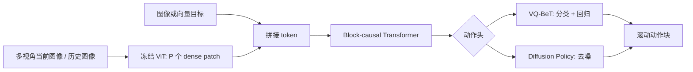

# Patch Policy：用密集视觉表征实现高效具身控制

> 作者：Damon Li
> 更新日期：2026年8月23日
> 证据状态：**A 级**。结论来自论文原文、官方项目/代码与官方数据集页；公众号推文只用于发现。[1] [2] [3]

## 1. 结论与证据等级

精密操作要区分插孔边缘、线缆姿态、抓取接触点和多物体相对位置，但很多策略将每帧图像压缩为一个 CLS token 或全局平均特征。Patch Policy 的论点是：这一步信息瓶颈会丢掉对控制最有价值的局部空间细节；而直接微调超大 VLA 又带来数十亿参数的训练与部署开销。因此它冻结大规模预训练 ViT，只把全部 dense patch token 送入轻量 Transformer 策略头。[1]

论文并非提出新的视觉预训练器，而是提出一套可与 VQ-BeT 或 Diffusion Policy 等动作头兼容的接口。其贡献应理解为“**让密集表征可被轻量策略有效、因果地消费**”，而不是证明任意 ViT 均优于所有端到端 VLA。[1] [2]

## 2. 问题设定、符号与假设

给定长度为 $T$ 的观测窗口、每帧 $P$ 个视觉 patch 和动作块 $\mathbf a$，策略目标是在不泄漏未来观测的前提下学习 $\pi_\theta(\mathbf a\mid o_{t-T+1:t},g)$。关键假设是：冻结 ViT 的 dense patch 保留了精细空间关系，且轻量时序策略能够利用这些关系；这一假设仅在论文的仿真和 Franka 平行夹爪任务中得到实证支持。[1]

## 3. 方法与完整推导

### 2.1 Observation trunk

输入图像 $o_t\in\mathbb{R}^{C\times H\times W}$ 经冻结 ViT 编码为 $P$ 个 $D$ 维 patch：

$$
E(o_t)\in\mathbb{R}^{P\times D}.
$$

给定长度为 $T$ 的观察窗口，视觉张量为 $\mathbb{R}^{T\times P\times D}$。若任务带图像目标，则拼接成 $T\times P\times 2D$；若目标是向量 $g\in\mathbb{R}^G$，则广播后得到 $T\times P\times(D+G)$。这让状态式环境也能兼容：令 $P=1$ 即可。[1]

### 2.2 Block-causal attention 的推导含义

将 token 展平为 $TP$ 长序列，并用块因果掩码：同一时刻内所有 patch 可双向注意，跨时刻只允许看到当前及过去。若 $i,j$ 是展平后的 token 下标，$p(i)=\lfloor i/P\rfloor$ 是其帧号，则可写为：

$$
M_{ij}=\begin{cases}
0,& p(j)\le p(i)\\
-\infty,& p(j)>p(i).
\end{cases}
$$

注意力为：

$$
\operatorname{Attn}(Q,K,V)=
\operatorname{softmax}\left(\frac{QK^\top}{\sqrt d}+M\right)V.
$$

该掩码同时满足两点：帧内全局空间推理（例如线缆与插座边缘同时可见），以及帧间不泄漏未来信息。策略在每帧最后一个 patch token 处读取动作头输出，再用 receding-horizon 执行一段动作块。[1]



### 2.3 行为克隆目标

Patch Policy 不绑定单一动作生成器。对 VQ-BeT，可把目标抽象为 codebook 分类与残差回归：

$$
\mathcal{L}_{\mathrm{VQ}}=
\mathcal{L}_{\mathrm{CE}}(\hat q,q)+
\lambda\|\hat{\mathbf a}-\mathbf a\|_2^2.
$$

对 Diffusion Policy，在噪声 $\epsilon$、时间 $k$ 和条件 $c$（patch token、状态、目标）下采用去噪目标：

$$
\mathcal{L}_{\mathrm{DP}}=
\mathbb E_{\mathbf a,\epsilon,k}
\left\|\epsilon-\epsilon_\theta(\mathbf a_k,k,c)\right\|_2^2.
$$

这两式是论文所述“VQ-BeT 的混合分类—回归损失”与“Diffusion Policy 的去噪目标”的标准显式形式；论文的主要对照变量是**表征粒度**（patch、CLS、average pooling），而非发明新的 action-head loss。[1]

## 4. 训练和推理算法

| 维度 | 披露内容 | 为什么重要 |
| :--- | :--- | :--- |
| 仿真环境 | Push-T、LIBERO Goal、BlockPush、Cube | 覆盖 2D 推动、目标条件多任务、多物体与分阶段操作 |
| 真机 | 7-DoF Franka + parallel-jaw gripper | 电缆插入、笔收集、工具悬挂，涵盖毫米级容差、长序列和接触丰富任务 |
| 比较对象 | CLS、全局均值池化、DynaMo、ACT、OpenVLA-OFT | 分离“patch token”效应与“动作头”效应 |
| 仿真统计 | 每 seed 100 trajectories；报告三随机种子均值/标准差 | 比只报单 checkpoint 更稳健，但选 best checkpoint 仍可能有选择偏差 |
| 真机统计 | 每个真实任务 20 trials，逐阶段累计成功率 | 能定位在哪个接触阶段失败，而不仅看 episode 二元成功 |
| 表征消融 | DINOv2、DINOv3、WebSSL、V-JEPA 2、SigLIP 2；冻结编码器 | 验证结论不只依赖一种编码器 |

## 5. 实验设计、基线与结果

在最具代表性的 Cable Insertion 中，DINOv2 Patch + VQ-BeT 的“完全插入”率为 0.70，DINOv2 CLS 为 0.60，OpenVLA-OFT 为 0.30（每组 20 次）。这一结果支持“空间密度对接触后闭环控制重要”的解释，但不能据此推断所有任务或所有机器人都将出现相同比例提升。[1]

## 7. 代码、模型、数据与许可证

官方实现采用 MIT 许可证，已发布四个仿真数据包以及 8 GPU 和 32 GB 单 GPU 配置。单 GPU 配置会缩短部分观察窗口（例如 LIBERO Goal 的 VQ-BeT 窗口从 10 降至 2），因此复现论文主结果前必须记录实际配置，不能把较小上下文的运行结果与主表直接比较。[2]

```bash
# 官方数据下载路径；数据内含可被 torch/numpy 反序列化的文件，只应使用可信来源
pip install "huggingface_hub==0.36.2"
huggingface-cli download gaoyuezhou/patch-policy-datasets \
  --repo-type dataset --local-dir patch_policy_datasets
cd patch_policy_datasets && for f in *.zip; do unzip -q "$f"; done

# 32GB 单 GPU 示例
conda env create -f conda_env.yml
conda activate patch-policy
python train_policy.py --config-name train_pusht_1gpu
```

| 资源 | 地址 | 内容与限制 |
| :--- | :--- | :--- |
| 论文 | [arXiv:2607.18236][1] | 方法、统计、附录超参数；预印本 |
| 官方代码 | [gaoyuezhou/patch_policy][2] | 仿真训练/评估、配置、encoder 消融；MIT |
| 官方数据 | [patch-policy-datasets][3] | Push-T 61 MB、Cube 2.2 GB、LIBERO 7.7 GB、Block Pushing 5.9 GB |
| DINOv3 权重 | [Hugging Face gated model][4] | 需单独申请访问；不是 Patch Policy 自带权重 |

## 6. 失败模式、局限性与复现条件

密集 patch 令序列长度由 $T$ 增长为 $TP$，注意力成本随 token 数近似二次增长。论文以小型 ViT、冻结 backbone、预计算特征和轻量头抵消了部分成本，但在多相机、高分辨率、长上下文的人形策略中仍须测量端到端延迟。其次，真实任务使用 Franka 与平行夹爪，不足以证明对多指手、软体物体或高速双臂协调的泛化。最后，官方数据仅覆盖仿真套件；真实机器人演示数据、标定文件和完整训练日志并未随仓库发布。

## 8. 参考资料

[1]: https://arxiv.org/html/2607.18236v1 "Patch Policy: Efficient Embodied Control via Dense Visual Representations"
[2]: https://github.com/gaoyuezhou/patch_policy "Patch Policy 官方代码"
[3]: https://huggingface.co/datasets/gaoyuezhou/patch-policy-datasets "Patch Policy 官方数据集"
[4]: https://huggingface.co/facebook/dinov3-vits16plus-pretrain-lvd1689m "DINOv3 gated 权重"
