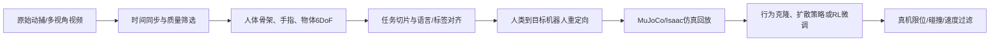

# MotionDecode：ChingMu 1000 小时具身动作数据集核验与使用指南

> 作者：Damon Li
> 更新日期：2026年8月22日
> 关联输入：[MotionDecode 项目主页](https://chingmudata.github.io/MotionDecode/)

## 1. 概述

**ChingMu 1000-Hour Embodied Motion Dataset（MotionDecode）** 是面向人形机器人、灵巧手、具身 AI 和虚拟制作的高精度多模态动作数据基础设施。官方项目页称数据通过光学动捕采集，包含全身人体动作、精细手指动作、物体 6DoF 位姿、多视角同步视频、任务标签、质量报告与人类到机器人的重定向信息。[1] 这使它适合覆盖两类通常分离的需求：一类是从人体运动学习动作先验，另一类是以视频/物体状态条件化学习操作策略。

数据集当前官方宣称的已完成核心规模为 1000 小时以上，覆盖 15 个以上真实场景、500 个以上任务、200 个以上道具和物体；其 2000 小时灵巧手扩展处于 2026 年第三季度扩展阶段，3000 小时非受控长尾行为是 2027 年的目标，均不应视为已下载内容。[1]

## 2. 数据模态与适用任务

| 模态 | 官方披露内容 | 可支持的研究任务 | 使用时的注意事项 |
| :--- | :--- | :--- | :--- |
| 全身动作 | 步行、跑跳、搬运、转身、弯腰等 | 人形 locomotion prior、动作生成、全身模仿 | 需映射到具体骨架定义与关节限位。 |
| 手指与物体追踪 | 细手指动作、对象刚体 6DoF 同步追踪 | 灵巧抓取、接触前姿态预测、操作分段 | 6DoF 轨迹不直接提供接触力/摩擦参数。 |
| 多视角视频 | 与动捕帧时钟对齐的多机位视频 | 视觉—动作学习、姿态估计、跨视角表示 | 必须核验相机内外参、帧率和遮挡标注。 |
| 任务与质量标签 | 结构化任务标签与质量检查 | 任务检索、条件行为克隆、数据过滤 | 应分离训练/验证主体与场景，避免泄漏。 |
| 机器人重定向 | 人→机器人骨架重定向及仿真验证 | Unitree G1 等平台的初始化策略 | 仍要在目标 URDF / 仿真器中二次校验。 |

对于行为克隆（Behavior Cloning），可把每帧视觉、机器人状态和任务条件视为 $o_t$，把重定向后的控制量视为 $a_t$，以最大似然或均方误差训练策略：

$$
\theta^*=\arg\min_\theta\;\mathbb{E}_{(o_t,a_t)\sim\mathcal{D}}\left[-\log\pi_\theta(a_t\mid o_{\leq t},\ell)\right].
$$

但人体动捕轨迹并不是机器人可执行轨迹。重定向过程应至少优化末端位姿、姿态和姿势正则项，同时满足关节限位：

$$
q^*=\arg\min_q\;\|f_{\mathrm{ee}}(q)-x_{\mathrm{human}}\|_W^2+
\lambda\|q-q_{\mathrm{rest}}\|_2^2,
\quad q_{\min}\leq q\leq q_{\max}.
$$

## 3. 下载、加载与许可核验

官方数据分发同时给出 [项目主页](https://chingmudata.github.io/MotionDecode/) 和 Hugging Face 数据集入口 [CMRobot/MotionDecode](https://huggingface.co/datasets/CMRobot/MotionDecode)。项目主页还出现 `ZIHLING/Chingmu-RobotData` 链接，因此建议以当前 Hugging Face 数据集卡所列出的维护者、文件树、版本和许可证为下载时的最终依据。[1] [2]

下面的代码用于**检查数据集卡和样本字段**，并不假定数据集可以无条件访问；若仓库设置 gated access 或文件较大，应按页面要求登录/申请后再下载。

```python
from datasets import load_dataset_builder

repo_id = "CMRobot/MotionDecode"
builder = load_dataset_builder(repo_id)
print("配置：", builder.builder_configs.keys())
print("特征：", builder.info.features)
print("描述：", builder.info.description[:800])
print("许可证：", builder.info.license)
```

下载前应保留数据集 revision hash、`README` 截图/副本和许可证文本，以保证实验可追溯。若数据包含可识别人物视频、语音或商业场景，应进一步审查隐私、肖像、使用范围和二次分发条款。

## 4. 推荐的数据处理流水线



实践中，建议按**主体、场景和任务对象**而不是随机帧划分数据集，避免同一动作片段的近似帧进入训练集和测试集。视觉策略还应评估相机位置变化、遮挡和光照变化；全身策略应单独报告脚部接触稳定性、末端误差、动作平滑性和任务完成率。对于需要力控的任务，MotionDecode 中的运动/位姿信息可作为先验，但无法替代腕部力/力矩、触觉或接触事件测量。

## 5. 局限性与待补充项

官方页面强调亚毫米级光学动捕与受控环境质量，但高精度运动轨迹不必然等于开放环境中的动力学多样性。当前公开说明中，项目仍在扩展灵巧手、音频和非受控长尾行为数据；公开资源中也未发现同行评议的统一 benchmark 论文来独立报告跨机器人、跨任务的标准化性能。因此，MotionDecode 最适合作为高质量动作先验和重定向数据源，不能单独作为通用真机能力的充分证据。[1] [2]

## 6. 参考资料

[1]: https://chingmudata.github.io/MotionDecode/ "ChingMu 1000-Hour Embodied Motion Dataset 官方项目主页"
[2]: https://huggingface.co/datasets/CMRobot/MotionDecode "CMRobot/MotionDecode 数据集页面"
