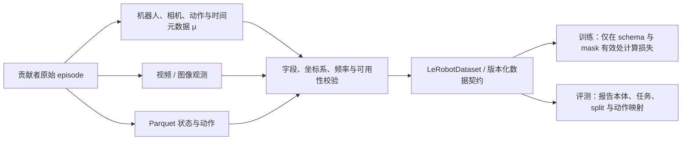

# 5.13 LeRobot Community Dataset V3：面向跨本体机器人学习的社区数据汇聚与数据契约

> 作者：Damon Li | 更新日期：2026年9月2日
> 证据状态：**官方数据卡 + 官方框架仓库 + ICLR 2026 论文**。本条目审计公开数据发布与工具链；不将聚合统计直接解释为跨本体策略性能。

## 1. 结论与证据等级

LeRobot Community Dataset V3 是 Hugging Face LeRobot 命名空间下的开放社区聚合数据集。官方数据卡与 API 元数据表明该资源为公开、非 gated、Apache-2.0；在本轮窗口内的最后修改时间为 2026-08-30T16:19:02Z。数据卡自报聚合了 791 个数据集、50,622 个 episodes、25,971,082 个 frames、251.5 小时数据、235 位贡献者、46 种本体和 12 种动作维度配置。[1] [2]

其更新价值不是宣称“已经解决跨本体学习”，而是把异构机器人数据的真实问题暴露为可操作的数据契约问题：视频缺失、动作/状态 dtype 不一致、相机数量不同、时间戳容差不同，以及 `train`、`validation`、`test` split 格式不一致。官方数据卡明确记录 dataset viewer 因 split 文件格式不同而不能加载，这是复现/访问摩擦而非可忽略的页面细节。[1]

| 结论 | 证据等级 | 适用边界 |
|---|---|---|
| V3 的公开性、许可证、规模与异构构成 | A | 直接来自官方数据卡/API；统计会随版本改变 |
| LeRobot 提供统一的机器人接口、Parquet + MP4/images 数据格式、训练与评测 CLI | A | 官方 `lerobot` 仓库与论文均可核验 |
| V3 跨本体数据仍存在视频、dtype、相机和时间对齐问题 | A | 是数据卡披露的质量/互操作性约束，不是实验性能结论 |
| V3 已使任意策略跨 46 种本体泛化 | 不成立 | 数据集覆盖范围不能代替受控泛化实验 |
| V3 viewer 暂不可用 | A | 仅指本次访问时数据卡所述的 split 格式问题；不等于数据文件或下载入口不可用 |

## 2. 问题设定、符号与假设

一个社区数据集不是把所有 episode 简单拼接即可用于策略学习。第 $e$ 个 episode 可写为异构时序记录：

$$
\mathcal E_e=\{(o_{e,t},s_{e,t},a_{e,t},\mu_e,t_{e,t})\}_{t=0}^{T_e-1},
$$

其中 $o$ 是一或多路图像/传感器观测，$s$ 是状态，$a$ 是动作，$\mu_e$ 是本体与控制语义元数据，$t_{e,t}$ 是跨模态时间戳。不同贡献者的本体、控制频率、坐标系、夹爪定义、相机布局和动作维度都可能不同，因此不存在无条件成立的“统一向量”。[1] [3]

| 符号 | 含义 | 跨数据集时的风险 |
|---|---|---|
| $\mathcal E_e$ | 第 $e$ 条 episode | 时长、采样率、任务边界不同 |
| $o_{e,t}$ | 视觉/传感器观测 | 缺视频、相机数不同或视角语义不同 |
| $s_{e,t}$、$a_{e,t}$ | 状态和动作 | dtype、维度、单位、坐标系与 action semantics 不同 |
| $\mu_e$ | 机器人、末端、相机、频率、字段 schema 等元数据 | 缺失时无法安全比较或重标定 |
| $m_{e,t}^{(k)}$ | 第 $k$ 个字段的可用性掩码 | 若忽略掩码，会把缺失误训练成零值 |
| $T_e$ | episode 长度 | 长度/频率差异会造成按 frame 计权的偏置 |

因此，V3 的最低学习前提是保留可检索的 schema 与缺失掩码，把“可比较性”建立在本体/传感器/动作语义元数据上，而不是仅依据统一文件后缀。数据卡的公开问题清单正是这一前提在实践中的反例集合。[1]

## 3. 方法与完整推导

### 3.1 从异构记录到条件策略目标

LeRobot 官方框架把数据组织为同步的 Parquet 状态/动作记录与 MP4 或图像视频，并通过 `LeRobotDataset`、机器人接口与 CLI 连接采集、训练和评测流程。[3] 这是一套工具/数据契约，不是一篇声称提出新损失函数的 V3 论文。为说明使用 V3 时必须显式处理的条件，可把任何行为克隆策略写成：

$$
p_\theta(a_{e,t:t+H-1}\mid o_{e,\le t},s_{e,\le t},\ell_e,\mu_e),
$$

其中 $\ell_e$ 是任务语言或文本条件，$\mu_e$ 不能被省略：不同本体的相同数值动作未必具有相同物理含义。

若已有经过验证的 action transform $g_{\mu_e}$ 将各本体动作映射到统一训练表示 $u$，一个带缺失掩码的最大似然/行为克隆目标可表示为：

$$
\mathcal L_{\mathrm{BC}}(\theta)=
-\frac{1}{\sum_{e,t}m_{e,t}^{a}}
\sum_{e,t}m_{e,t}^{a}
\log p_\theta\!\left(g_{\mu_e}(a_{e,t:t+H-1})\mid
\phi(o_{e,\le t},s_{e,\le t},\mu_e),\ell_e\right).
$$

这里 $m_{e,t}^{a}$ 排除缺失或无效 action，$\phi$ 是保留相机/状态字段和时间同步信息的编码器。上述公式是基于公开数据契约做的**使用者侧推导**：它不是 V3 作者所报告的统一训练配方。关键要求是：若 $g_{\mu_e}$、坐标系或夹爪语义未公开，不能假定可直接混训。[1] [3]

### 3.2 时间同步和多视角对齐的必要条件

设一条视觉流的时间为 $t_{e,j}^{(c)}$，控制动作的时间为 $t_{e,t}^{(a)}$。只有当

$$
\left|t_{e,j}^{(c)}-t_{e,t}^{(a)}\right|\le \epsilon_e
$$

且相机 $c$ 的坐标/内外参语义可追溯时，才可把该帧作为动作 $a_{e,t}$ 的同步观测。$\epsilon_e$ 应由数据集元数据而非跨贡献者的单一常数决定。数据卡所列不同 timestamp tolerance、多相机结构和缺视频现象，意味着此条件必须在 dataset/episode 级别检查。[1]



## 4. 训练和推理算法

建议将 V3 作为“先审计、后混训”的数据基础设施。第一步按 dataset/episode 读取 `meta`，检查本体、末端执行器、相机、动作字段、频率、许可与 attribution；第二步验证视频与 Parquet 是否可同步，并为每个字段建立 $m^{(k)}$；第三步仅对存在明确坐标/动作转换的子集构造 batch；第四步按 episode、任务和本体切分，避免同场景或同对象泄漏到 OOD 测试；第五步在部署前把模型动作从统一表示逆变换回目标机器人的安全 action space。

LeRobot 官方仓库提供 `lerobot-record`、`lerobot-train`、`lerobot-eval` 等接口，支持将具体机器人实现接入同一软件面；它不消除标定、安全约束、动作变换与真实机器人的硬件兼容性责任。[3]

```text
for dataset in selected_v3_subsets:
    inspect(dataset.meta, license, embodiment, action_schema, camera_schema)
    validate_timestamp_alignment(dataset, tolerance=metadata_defined)
    exclude_or_mask_missing_modalities(dataset)
    if verified_transform(dataset.embodiment, target_action_space):
        add_to_train_or_eval_split(dataset)

train_policy_with_schema_conditioning_and_masks()
evaluate_per_embodiment_and_per_task()
verify_action_bounds_before_real_robot_execution()
```

## 5. 实验设计、基线与结果

V3 当前是一项数据发布，不是公开数据卡中已经给出统一策略排行榜的受控 benchmark。因此本节审计数据集设计与可验证统计，而不杜撰模型胜率。

| 维度 | 官方数据卡披露 | 对评测设计的含义 |
|---|---|---|
| 规模 | 791 datasets、50,622 episodes、25,971,082 frames、251.5 h | 不能只用 frame 数比较训练信息量；频率和时长分布会影响权重 |
| 异构性 | 46 embodiments、12 action dimensions；single-arm 699，bimanual 53，mobile 27，humanoid 10 | 应分别报告各本体簇结果，不能以总体均值掩盖 single-arm 占比 88.4% |
| 贡献来源 | 235 contributors | 需要记录许可证、数据谱系与同源数据泄漏风险 |
| 存储契约 | Parquet observations、multi-view MP4、metadata | 训练/评测脚本需要按 schema 而非假定固定视频数或 dtype |
| 公开问题 | 缺视频、dtype/相机数/时间容差不一致；viewer split 格式不兼容 | 数据可下载并不等于每个 subset 已可无修改地加载或比较 |

一个可复核的 V3 下游实验至少应固定：训练的 dataset IDs 与 commit SHA、许可筛选规则、每个本体的 $g_{\mu}$、图像和状态字段、对齐容差、episode 级 split、动作频率、目标机器人安全过滤、trial 数及逐本体/逐任务结果。没有这些要素时，“跨本体平均分”不可解释。[1] [3]

## 6. 失败模式、局限性与复现条件

V3 最大的风险是把格式可读误认为语义可拼接。缺失视频可能使视觉策略的条件分布改变；float/int 或单位不一致会令动作/状态尺度失真；不同相机数量和布局会让同一个视觉编码器学到视角捷径；时间容差不透明则可能形成 observation–action 错配。数据卡已经披露这些风险，使用者应把它们纳入筛选与日志，而不是用插值或零填充默默掩盖。[1]

本次访问时数据卡还标注 viewer 因 split 格式不兼容无法加载。它既不是“数据失效”的证据，也不意味着任何用户都能立即以默认 viewer 审阅全部样本；复现应直接以版本化数据文件、元数据和官方加载工具进行检查。若研究涉及真实机器人，LeRobot 的通用接口不代替机械限位、碰撞检测、控制频率和动作范围验证。[1] [3]

## 7. 代码、模型、数据与许可证

| 资源 | 入口 | 状态与许可证 | 复现含义 |
|---|---|---|---|
| V3 数据卡 | [Hugging Face 数据卡][1] | 公开、非 gated；Apache-2.0 | 统计、字段问题、下载与限制的主证据 |
| V3 元数据 API | [官方 API][2] | `lastModified` 为 2026-08-30T16:19:02Z | 用于本轮窗口判定；实际运行应固定 revision/SHA |
| LeRobot 框架 | [官方 GitHub][3] | Apache-2.0 | 提供数据接口、采集、训练、评测和硬件扩展接口 |
| LeRobot 论文 | [arXiv / ICLR 2026][4] | CC-BY-4.0 预印本页面 | 解释框架动机与范围，不构成 V3 性能报告 |
| 模型权重 | 数据集卡未统一提供 | 不适用 | V3 是数据发布；下游模型由使用者或各项目单独决定 |

## 8. 参考资料

[1]: https://huggingface.co/datasets/lerobot/community_dataset_v3 "LeRobot Community Dataset V3 — official dataset card"
[2]: https://huggingface.co/api/datasets/lerobot/community_dataset_v3 "LeRobot Community Dataset V3 — official metadata API"
[3]: https://github.com/huggingface/lerobot "LeRobot — official GitHub repository"
[4]: https://arxiv.org/abs/2602.22818 "LeRobot: An Open-Source Library for End-to-End Robot Learning — arXiv / ICLR 2026"
