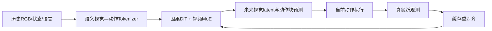

# LingBot 与 FabriVLA：从多构型预训练到可校准动作块

> 作者：Damon Li
> 更新日期：2026年8月22日
> 关联线索：[LingBot-VLA 2.0 微信入口](https://mp.weixin.qq.com/s/srAP6fl30SqMfOOXUW__wQ)、[LingBot-VA 2.0 微信入口](https://mp.weixin.qq.com/s/UfyQkKHechSYr3MkK8orGQ?scene=1)、[FabriGym 微信入口](https://mp.weixin.qq.com/s/or6JEEvLS3C2HW7TTVRMhw)

## 1. 概述

本节将三类常被并列讨论、但证据类型不同的工作分开处理。**LingBot-VLA 2.0** 是面向多机器人构型（embodiment）泛化的视觉—语言—动作模型；**LingBot-VA 2.0** 是针对闭环机器人控制重新设计的 Video-Action 模型；**FabriVLA** 则是具有动作不确定性校准机制的轻量级 VLA 论文。三者共同指向一个工程问题：如何在不牺牲细粒度接触操作的前提下，使预训练模型可适配多构型、可低延迟执行，并向部署端提供风险信息。[1] [2] [3]

需要注意，FabriGym 与 FabriX 的工业平台定位来自优艾智合的公开企业材料，而 FabriVLA 的具体架构和 Meta-World / LIBERO-Safety 实验结论以论文为准；本文不将二者自动视为同一开源产品或同一训练系统。[3] [4]

## 2. LingBot-VLA 2.0：数据、统一动作空间与 MoE 扩展

LingBot-VLA 2.0 的官方技术页披露，其预训练数据由 **50,000 小时真实机器人数据**和 **10,000 小时无具身约束的第一视角操作数据**组成；数据处理对视频质量、多视角对齐、轨迹连续性、速度/加速度/jerk 异常和静态信号占比进行逐级过滤。[1] 该设计的意图不是简单拼接数据，而是降低视觉、状态与动作时间错位引入的监督噪声。

模型将约 20 种机器人构型映射到统一动作表示，覆盖机械臂末端、夹爪、底盘、腰部、头部与手等自由度，再用稀疏 Mixture-of-Experts（MoE）提升固定激活参数预算下的容量。[1] 从建模角度，可将多构型策略抽象为：

$$
a_{t:t+H}=\pi_\theta(o_{\leq t},\ell,e),
$$

其中 $o_{\leq t}$ 是多模态观测历史，$\ell$ 是语言条件，$e$ 表示构型及其动作掩码。统一动作空间的价值在于将跨本体迁移问题转化为共享语义动作与构型条件化解码，而非为每个本体训练完全独立的策略头。

官方页还提供了对应的论文、代码仓库、Hugging Face 权重集合和 ModelScope 集合，因此其基础复现入口相对完整。[1] [5]

## 3. LingBot-VA 2.0：原生 Video-Action 闭环

LingBot-VA 2.0 没有将通用视频生成器直接后接控制头，而是围绕控制重构 tokenizer、因果建模与推理链路。官方技术说明包含四个关键点：语义视觉—动作 tokenizer、因果 DiT（Diffusion Transformer）视频—动作预训练、视频流的稀疏 MoE，以及多动作块预测。[2]

其训练可用条件流匹配形式概括为：对未来视觉 latent $z$ 与未来动作块 $a$ 施加噪声路径，并最小化速度场预测误差

$$
\mathcal{L}=\mathbb{E}_{t}\left[\|u^{(z)}_\theta(z_t,c)-v_z\|_2^2+\lambda\|u^{(a)}_\theta(a_t,c)-v_a\|_2^2\right],
$$

其中 $c$ 包含历史观测、语言与高层任务上下文。部署端的 **Foresight Reasoning** 将预测、当前动作执行和新观测重对齐异步重叠；官方页面称其结合一致性蒸馏、FP8 TensorRT 编译、长上下文注意力优化等实现超过 4 倍端到端加速，并展示了最高 150 Hz 的播放示例。该表述应理解为官方系统披露，硬件与任务配置须以随附技术报告为准。[2] [6]

## 4. FabriVLA：轻量化 VLA 与动作不确定性

FabriVLA 论文提出在 VLM 的浅层与中层之间做特征融合，以保留精细空间信息；其 Flow Matching 动作头用门控自注意力逐步引入 action token 的跨步依赖。[3] 论文报告模型参数量为 **0.88B**，在 Meta-World MT50 上达到 **90.0% 平均成功率**。与单纯追求成功率不同，作者进一步提出 Joint Conformal Action Chunk Calibration（JCAC）：在冻结策略上增加轻量残差尺度头，构造由用户置信度控制的动作前缀预测集合，用于部署前风险排序。[3]

若第 $k$ 步动作预测为 $\hat a_k$，尺度估计为 $s_k$，则可将动作块的保守集合写作：

$$
\mathcal{C}_{1:H}(x)=\{a_{1:H}: |a_k-\hat a_k(x)|\leq q_{1-\alpha}s_k(x),\;\forall k\leq H\},
$$

其中 $q_{1-\alpha}$ 由校准集确定。该做法不会替代碰撞检测、力矩限制或安全控制器，但能在调用前给出数据驱动的策略不确定性信号。[3]

## 5. 工业平台：FabriGym / FabriX 的适用边界

优艾智合将 FabriGym 描述为面向工业场景的具身技能预训练平台：通过三维扫描与高保真场景重建，把现场迁移至仿真环境，再进行技能训练与部署准备。[4] 这与 VLA 论文中的通用基准评测相互补充：前者强调任务现场重建、流程和交付，后者强调模型架构、校准与标准化基准。当前未发现可公开确认的 FabriGym/FabriX 官方模型权重、GitHub 仓库或数据下载页；使用者应将其视为企业平台信息，而非已开源框架。[4]

| 对象 | 主要贡献 | 已核验开放资源 | 使用时的边界 |
| :--- | :--- | :--- | :--- |
| LingBot-VLA 2.0 | 多构型统一动作空间、MoE 预训练 | 论文、GitHub、HF、ModelScope | 真实评测细节以论文与官方页为准。 |
| LingBot-VA 2.0 | 原生视频—动作预训练与异步闭环 | 技术报告、官方页面、组织级资源入口 | 具体权重与所有变体开放状态应逐项核验。 |
| FabriVLA | 0.88B 轻量 VLA、JCAC 风险校准 | arXiv 论文 | 截至本次核验未见官方代码/权重链接。 |
| FabriGym / FabriX | 工业技能预训练与环境重建 | 公司官网新闻 | 代码、权重、数据集未公开。 |

## 6. 资源与复现入口

- LingBot-VLA 2.0 论文与技术页：[arXiv](https://arxiv.org/abs/2607.06403)、[官方页面](https://technology.robbyant.com/lingbot-vla-v2)。
- LingBot-VLA 2.0 开源资源：[GitHub](https://github.com/robbyant/lingbot-vla-v2)、[Hugging Face 集合](https://huggingface.co/collections/robbyant/lingbot-vla-v2)、[ModelScope 集合](https://modelscope.cn/collections/Robbyant/LingBot-VLA-V2)。
- LingBot-VA 2.0：[官方页面](https://technology.robbyant.com/lingbot-va-v2)、[技术报告 PDF](https://github.com/Robbyant/lingbot-va/blob/main/LingBot_VA2_paper.pdf)、[Robbyant GitHub 组织](https://github.com/robbyant)。
- FabriVLA：[arXiv](https://arxiv.org/abs/2607.08575)。
- FabriGym / FabriX：[优艾智合官网](https://zh.youibot.com/)。

## 7. 参考资料

[1]: https://technology.robbyant.com/lingbot-vla-v2 "LingBot-VLA 2.0 官方技术页面"
[2]: https://technology.robbyant.com/lingbot-va-v2 "LingBot-VA 2.0 官方技术页面"
[3]: https://arxiv.org/abs/2607.08575 "FabriVLA: A Lightweight Vision-Language-Action Model with Conformal Action Chunk Uncertainty"
[4]: https://zh.youibot.com/ "优艾智合机器人官方网站"
[5]: https://github.com/robbyant/lingbot-vla-v2 "Robbyant / LingBot-VLA-V2"
[6]: https://github.com/Robbyant/lingbot-va/blob/main/LingBot_VA2_paper.pdf "LingBot-VA 2.0 技术报告"
