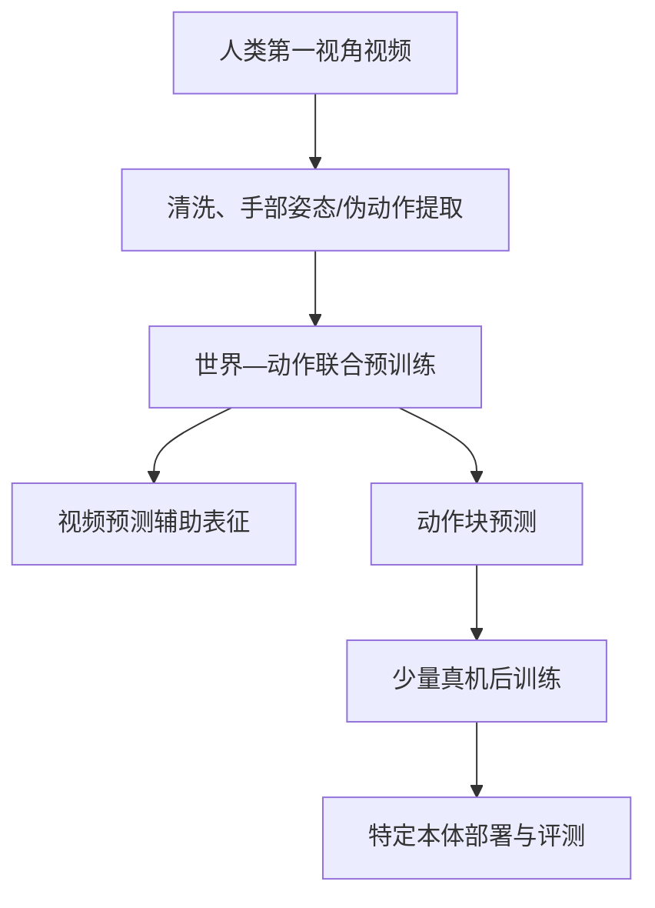

# Khora、GEN-1.5 与 Dyna-2：世界状态、物理提示与跨本体缩放

> 作者：Damon Li
> 更新日期：2026年8月22日
> 关联线索：[Khora](https://mp.weixin.qq.com/s/ONS1M4qMnh5xMRV_sB69Ug)、[GEN-1.5](https://mp.weixin.qq.com/s/O8AYpvyGz1ywrvMeh4mKrw)、[Dyna-2](https://mp.weixin.qq.com/s/_1nWy6AZLkqMfj5W4aHQ_g)

## 1. 概述：三个“世界”概念，三种证据状态

2026 年 8 月出现的 Khora、GEN-1.5 和 Dyna-2 均把“世界建模”用于机器人泛化，但技术路径和公开证据不同。Khora 是有公开 arXiv 技术报告的**多智能体共享世界状态模型**；GEN-1.5 是 Generalist AI 在官方博客披露的**单次示教具身基础模型**；Dyna-2 是 Dyna Robotics 在官方研究页披露的**人类视频预训练世界动作模型（WAM）**。因此，本文对 Khora 可引用论文中的机制和实验设计；对 GEN-1.5、Dyna-2 则使用“官方披露”措辞，不能将其等同于同行评审结论。[1] [2] [3]

| 模型 | 核心问题 | 主要范式 | 一手证据 | 开源状态（本次核验） |
| :--- | :--- | :--- | :--- | :--- |
| Khora | 多智能体视角随人口增长时的一致性与计算成本 | 共享世界状态 + 视角查询渲染 | arXiv 技术报告、项目页 | 研究预览；未见官方代码/权重发布。 |
| GEN-1.5 | 如何从极少示范快速学习新物理技能 | 长上下文多模态策略与 physical prompting | 公司官方研究博客 | 未见论文、代码或权重。 |
| Dyna-2 | 人类视频规模是否能规律性迁移到机器人 | Video Diffusion + Action Transformer 的 WAM | 公司官方研究页与新闻稿 | 未见论文、代码或权重。 |

## 2. Khora：用共享世界状态代替视角间稠密交互

Khora 的论文指出，固定人数训练的多智能体世界模型很难在推理期直接扩展到未见人数。其核心是将**世界状态演化**与**每个相机视角的视觉渲染**解耦：STBoard 维护静态场景记忆和动态实体状态，智能体仅向这一共享状态写入动作引起的变化；渲染器根据目标相机查询共享状态，独立合成相应视角。[1]

若有 $N$ 个实体、$N_v$ 个待渲染视图，传统在视频 token 层显式建模任意视角交互的代价容易随组合关系增长。Khora 试图将实体状态更新与视图生成分离，使主要渲染开销近似与 $N_v$ 线性相关：

$$
S_{t+1}=f_\theta(S_t,A_t),\qquad I^{(v)}_{t+1}=g_\phi(S_{t+1},K_v,T_v),
$$

其中 $S_t$ 是共享空间状态，$A_t$ 是全体动作，$K_v,T_v$ 是第 $v$ 个视角的内外参。论文声称模型可在不重训的前提下扩展到未见数量的智能体，并通过多视角视觉质量与一致性指标进行评估。[1]

> Khora 的贡献不是“已经解决真实多机器人操作”，而是为开放世界多观察者仿真提出一套可扩展共享状态与渲染分离架构。真实机器人中的感知、状态估计、接触物理与安全控制仍需要额外系统验证。

## 3. GEN-1.5：以物理轨迹作为上下文提示

Generalist AI 披露 GEN-1.5 具有 30 秒视频记忆窗口，能处理视频、语言、传感器与本体感觉，并以 100 Hz 输出动作轨迹。其“physical prompting”做法是把 3—12 秒示教的传感器—动作序列放入上下文，直接让策略执行新任务，而不做梯度更新。[2]

官方博客报告：在 10 个短时程操作任务上，单次上下文示教的平均成功率为 $59\%\pm10\%$；使用约 5 分钟数据做 10 步梯度更新后为 $83\%\pm9\%$。它还展示了示教组合、仿真示教到真机提示以及人类手部示教到机器人执行等案例。[2] 这些结果强调的是**学习效率和即时适应性**，但官方亦明确任务简单且短时程，纯上下文方式比充分微调更脆弱。因此，工程上应将其作为“快速获得可行策略”的上层机制，并保留安全约束、失败检测和任务级回退策略。

## 4. Dyna-2：将视频扩展为机器人预训练的数据轴

Dyna-2 采用视频扩散骨干和动作 Transformer，在训练中联合预测未来视频与未来动作；视频 token 使用因果掩码，动作 token 使用双向自注意力并读取视频上下文。本质上，视频损失塑造共享表示，而部署时策略可保持反应式，不必先生成完整未来视频。[3]

其联合流匹配目标可概括为：

$$
\mathcal{L}_{\mathrm{co}}=\mathbb{E}\|u^{\mathrm{vid}}_\theta(z_t;c)-(z-\epsilon_z)\|_2^2+
\lambda\mathbb{E}\|u^{\mathrm{act}}_\theta(a_t;c)-(a-\epsilon_a)\|_2^2.
$$

官方研究页称该模型用超过 100 万小时第一视角人类操作视频训练，从嵌套的 1k、10k、100k 到 1M 小时子集验证：更大的人类视频规模不仅改善留出人类数据上的预测，也单调改善未参与预训练的机器人数据离线预测；进一步在多个真机任务上观察到预训练规模与后训练性能的正相关。[3] 这是一项重要的企业披露，但评测代码、完整数据和独立复现实验尚未公开，因此结论应谨慎解读为**官方报告的缩放趋势**，而非通用定律的最终证明。

## 5. 比较与部署建议

三种路线可组合但不可混同。Khora 适合提供多主体、跨视角的一致世界状态；Dyna-2 的思路强调大规模人类视频的跨本体预训练；GEN-1.5 侧重在长上下文中用少量示范迅速提示策略。若用于真实机器人，建议先选择统一动作接口并建立可回放的数据记录，再在独立安全层中处理碰撞、力阈值、关节限位和异常检测；不要仅根据视频生成质量判断物理操作可靠性。

| 问题 | 优先方法 | 需补齐的工程组件 |
| :--- | :--- | :--- |
| 多机器人/多相机仿真一致性 | Khora 式共享状态 | 标定、对象追踪、动力学与碰撞模型。 |
| 海量人类视频预训练 | Dyna-2 式世界—动作联合目标 | 合规数据来源、手部/动作伪标注质量控制、跨本体后训练。 |
| 快速示教新技能 | GEN-1.5 式上下文提示 | 任务失败检测、示教检索、策略回退与人工接管。 |

## 6. 可用资源与待补充项

- Khora：[论文](https://arxiv.org/abs/2608.08600)、[RhOS 项目页](https://rhos.ai/research/khora)、[Ophilus 演示与技术报告](https://ophilus.ai/khora)。
- GEN-1.5：[Generalist AI 官方研究博客](https://generalistai.com/blog/gen-1.5)。截至本次核验未见同行评审论文、官方训练代码或权重下载。
- Dyna-2：[Dyna Robotics 官方研究页](https://www.dyna.co/dyna-2)、[官方新闻稿](https://www.prnewswire.com/news-releases/dyna-robotics-unveils-dyna-2-world-action-model-demonstrating-first-true-scaling-law-in-robotics-powered-entirely-by-human-data-302847114.html)。截至本次核验未见同行评审论文、官方训练代码或权重下载。

## 7. 参考资料

[1]: https://arxiv.org/abs/2608.08600 "Population-Scalable Multi-Agent World Modeling"
[2]: https://generalistai.com/blog/gen-1.5 "GEN-1.5: Embodied Foundation Models are One-Shot Learners"
[3]: https://www.dyna.co/dyna-2 "Dyna-2: A 1-Million-Hour Scaling Law for World-Action Models"
