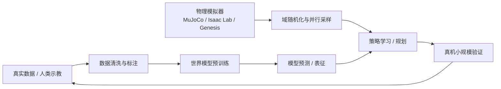

# 世界模型与具身仿真资源图谱：经典基线、开源平台与使用边界

> 作者：Damon Li
> 更新日期：2026年8月22日
> 关联线索：[世界模型历史微信入口](https://mp.weixin.qq.com/s/YHr0X2tXk6R9h1TCObWMJA)、[物理仿真到世界模型微信入口](https://mp.weixin.qq.com/s/ju2ymeVW75WnJsExEErpLw)

## 1. 概述

具身智能中的“世界模型”并非单一技术。它既可以是在 latent space 预测状态转移的模型式强化学习系统，也可以是从视频生成可交互环境的生成模型，或作为机器人策略预训练辅助目标的视觉—动作联合模型。与之互补的物理模拟器则通过显式动力学、接触和渲染生成可控轨迹。正确的工程选择通常不是“世界模型取代仿真器”，而是根据数据、可控性、物理精度与计算成本将二者组合。[1] [2]

## 2. 经典世界模型路线

| 路线 | 代表工作 | 状态表示 / 目标 | 已核验开源资源 | 适合学习的问题 |
| :--- | :--- | :--- | :--- | :--- |
| 潜在动力学 | World Models、Dreamer 系列 | VAE/RSSM latent 中想象 rollout | [World Models](https://worldmodels.github.io/)、[DreamerV3](https://github.com/danijar/dreamerv3) | 如何降低像素控制的样本成本。 |
| 搜索导向隐模型 | MuZero | 表征、动力学、奖励、价值联合学习 | [论文](https://arxiv.org/abs/1911.08288) | 如何在未知规则下进行规划搜索。 |
| 联合表征预测 | I-JEPA | 预测抽象表征而非像素 | [代码](https://github.com/facebookresearch/ijepa) | 表征学习与掩码预测。 |
| Transformer / 视觉 token | IRIS、Genie | token 化视觉动态与交互生成 | [IRIS 论文](https://arxiv.org/abs/2209.00588)、[Genie 论文](https://arxiv.org/abs/2402.15391) | 从视频学习可交互环境。 |
| 扩散世界模型 | DIAMOND | 像素空间扩散动态 | [项目页](https://diamond-wm.github.io/)、[代码](https://github.com/eloialonso/diamond) | 高保真视觉预测与低数据 RL。 |
| 自动驾驶生成模型 | GAIA-1 | 视频、文本、动作条件化 | [论文](https://arxiv.org/abs/2309.17080) | 受控驾驶场景生成。 |

World Models 提出将高维视觉压缩到 latent，再由记忆模型预测动态；Dreamer 把策略优化放在 learned latent dynamics 的 imagined trajectories 中。[1] [3] MuZero 说明即使不重建观测，也能学习足以支持规划的内部模型。[4] I-JEPA、IRIS、Genie 和 DIAMOND 则分别代表抽象预测、token 动态、从视频构造交互环境与扩散视觉动态等方向。[5] [6] [7] [8]

一个简化的模型式策略优化目标是：

$$
\max_\pi\;\mathbb{E}_{p_\theta(s_{t+1}\mid s_t,a_t)}\left[\sum_{t=0}^{T}\gamma^t r(s_t,a_t)\right],
$$

其中 $p_\theta$ 是学习到的世界模型。核心风险在于，若 $p_\theta$ 在长 rollout 上累积偏差，策略会“利用模型漏洞”而不是真正学会环境行为；因此不确定性估计、短视界 MPC、真实数据回灌和仿真校验十分重要。

## 3. 物理仿真平台：能力与取舍

| 平台 | 官方入口 | 突出能力 | 适用场景 | 常见限制 |
| :--- | :--- | :--- | :--- | :--- |
| MuJoCo / MJX | [GitHub](https://github.com/google-deepmind/mujoco) | 高性能接触动力学、MJCF、JAX 加速生态 | 控制、RL、灵巧操作 | 接触参数与传感器模型仍需标定。 |
| Isaac Lab | [GitHub](https://github.com/isaac-sim/IsaacLab) | NVIDIA GPU 并行、Isaac Sim 工作流、机器人 RL/IL | 大规模并行训练、Sim-to-Real | 对 GPU 与 Omniverse 生态依赖较强。 |
| Genesis | [GitHub](https://github.com/Genesis-Embodied-AI/genesis-world) | 多物理场、统一场景/渲染工作流 | 生成式仿真与机器人研究 | 生态与接口仍在快速迭代。 |
| Habitat | [官网](https://aihabitat.org/) | 大规模室内三维场景与导航/重排 | 视觉导航、移动操作 | 接触与细粒度操控保真度有限。 |
| AI2-THOR | [官网](https://aithor.allenai.org/) | 交互式室内场景、任务对象语义 | 视觉交互、任务规划 | 偏离真实传感器/动力学时需额外适配。 |

## 4. 世界模型与仿真器如何协同

世界模型最擅长从真实或互联网视频中学习视觉规律、行为先验和长尾场景覆盖；物理模拟器最擅长产生可重复的反事实干预、精确控制信号和安全训练回路。推荐的混合流程是：先通过视频/示教预训练得到表征或初始策略；再在模拟器中对动力学、接触和观测进行域随机化；最后以少量真机数据做系统辨识和闭环校准。

不宜把 FVD、PSNR 或视频观感直接等价为抓取成功率。机器人任务还需要报告末端误差、接触稳定性、任务成功率、异常恢复率、实时频率和硬件安全事件。对高风险操作，应该用显式碰撞检查、速度/力矩阈值和保守控制器包裹学习策略。

## 5. 资源下载与复现提示

- **DreamerV3**：从 [官方仓库](https://github.com/danijar/dreamerv3) 获取环境配置与训练入口；适合做 latent world model / RL 对照实验。
- **DIAMOND**：从 [官方代码库](https://github.com/eloialonso/diamond) 和 [项目页](https://diamond-wm.github.io/) 获取复现实验说明；其结论主要面向 Atari 100k，不应直接外推至真实机械臂。
- **MuJoCo**：从 [DeepMind 官方仓库](https://github.com/google-deepmind/mujoco) 安装与下载 Menagerie 资产；使用前需检查模型许可证。
- **Isaac Lab**：从 [官方仓库](https://github.com/isaac-sim/IsaacLab) 阅读安装、任务与训练工作流；务必匹配驱动、CUDA 与 Isaac Sim 版本。
- **Genesis**：从 [官方仓库](https://github.com/Genesis-Embodied-AI/genesis-world) 和 [文档](https://genesis-world.readthedocs.io/) 跟踪版本变化。

## 6. 参考资料

[1]: https://arxiv.org/abs/1803.10122 "World Models"
[2]: https://arxiv.org/abs/2605.12090 "World Action Models: The Next Frontier in Embodied AI"
[3]: https://arxiv.org/abs/1912.01603 "Dream to Control: Learning Behaviors by Latent Imagination"
[4]: https://arxiv.org/abs/1911.08288 "Mastering Atari, Go, Chess and Shogi by Planning with a Learned Model"
[5]: https://arxiv.org/abs/2301.08243 "I-JEPA"
[6]: https://arxiv.org/abs/2209.00588 "IRIS"
[7]: https://arxiv.org/abs/2402.15391 "Genie: Generative Interactive Environments"
[8]: https://arxiv.org/abs/2405.12399 "DIAMOND"
