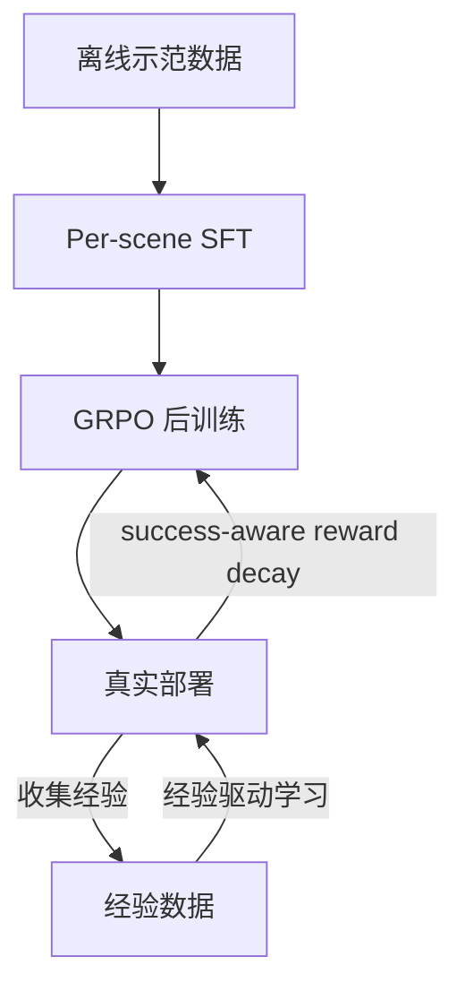

# 2026 年 7—8 月 VLA 后训练与强化学习微调：结构化探索、GRPO 与零售场景部署

> 作者：Damon Li | 更新日期：2026年8月22日
> 证据状态：预印本（arXiv）

## 1. 结论与证据等级

VLA 后训练与强化学习微调是 2026 年 7—8 月的重要研究方向。ExToken 揭示了 VLA-RL 中的探索停滞瓶颈并提出结构化探索 token；Z-1 将 GRPO 引入 flow-based VLA 的模块化 RL 后训练；DEED 关注从 benchmark 到真实零售场景的部署差距。三者共同表明 VLA 后训练正从简单行为克隆微调进入 RL/advantage/token selection/reward shaping 阶段。[1] [2] [3]

| 工作 | 核心问题 | 方法 | 证据等级 |
| :--- | :--- | :--- | :--- |
| ExToken | VLA-RL 探索停滞 | exploration token + state-conditioned token selector | A |
| Z-1 | flow-based VLA 的 RL 后训练 | per-scene SFT + GRPO | A |
| DEED | lab-to-store 部署差距 | 数据高效后训练 + 经验驱动学习 | A |

## 2. 问题设定、符号与假设

### 2.1 符号表

| 符号 | 含义 |
| :--- | :--- |
| $\pi_\theta$ | VLA 策略 |
| $s_t, a_t$ | 状态与动作 |
| $r(s,a)$ | 奖励函数 |
| $\tau = (s_0, a_0, \ldots, s_T)$ | 轨迹 |
| $\mathcal{D}_{\mathrm{demo}}$ | 离线示范数据集 |
| $z_i^{\mathrm{explore}}$ | 第 $i$ 个 exploration token |
| $\hat{A}_t$ | 优势函数估计 |
| $R(\tau)$ | 轨迹回报 |

### 2.2 核心问题

- **ExToken**：VLA-RL 中策略倾向于重复示范中的少数模式，导致状态-动作覆盖不足。论文揭示轨迹多样性比 rollout 数量更重要。[1]
- **Z-1**：flow-based VLA（如 $\pi_{0.5}$）的 RL 后训练缺乏模块化框架，难以在多场景上高效训练。[2]
- **DEED**：benchmark 性能不等于真实零售场景可用性，控制频率对齐、视觉条件差异和 VLA 对完整策略的过度依赖是关键差距。[3]

## 3. 方法与完整推导

### 3.1 ExToken：结构化探索

ExToken 从离线示范中提取离散行为先验 $z_1^{\mathrm{explore}}, \ldots, z_K^{\mathrm{explore}}$，作为条件 token 注入策略：

$$
\pi_\theta(a_t \mid s_t, z_i^{\mathrm{explore}}) \approx \pi(a_t \mid s_t, \text{behavioral mode } i)
$$

训练时随机选择不同的 $z_i^{\mathrm{explore}}$，鼓励策略探索多样化的行为模式。部署时使用 state-conditioned token selector $\phi(s_t)$ 预测最优 token：

$$
i^* = \phi(s_t), \quad \hat{a}_t = \pi_\theta(a_t \mid s_t, z_{i^*}^{\mathrm{explore}})
$$

其 RL 目标可概括为：

$$
\mathcal{L}_{\mathrm{ExToken}} = -\mathbb{E}_{\tau \sim \pi_\theta(\cdot \mid z_i)} \left[ \sum_{t=0}^{T} \hat{A}_t \right] + \alpha \mathcal{L}_{\mathrm{selector}}
$$

其中 $\hat{A}_t$ 是 GAE 优势估计，$\mathcal{L}_{\mathrm{selector}}$ 是 token selector 的监督损失。

### 3.2 Z-1：GRPO for Flow-based VLA

Z-1 采用两阶段后训练：

**阶段 1：Per-scene SFT**

$$
\mathcal{L}_{\mathrm{SFT}} = \mathbb{E}_{(o, \ell, a) \sim \mathcal{D}_{\mathrm{scene}}} \left[ \| a - \hat{a}_\theta(a_t^{(t)}, o, \ell, t) \|_2^2 \right]
$$

**阶段 2：Task-wise GRPO**

GRPO（Group Relative Policy Optimization）对每组 $G$ 条轨迹计算组内相对优势：

$$
\mathcal{L}_{\mathrm{GRPO}} = -\mathbb{E}_{\{ \tau_j \}_{j=1}^G \sim \pi_{\theta_{\mathrm{old}}}} \left[ \sum_{j=1}^G \tilde{A}_j \log \pi_\theta(\tau_j) \right]
$$

其中 $\tilde{A}_j = \frac{R(\tau_j) - \mathrm{mean}(R)}{\mathrm{std}(R)}$ 是组内标准化优势。Z-1 还引入 success-aware reward decay，使成功轨迹的奖励随时间衰减以鼓励早期成功。

### 3.3 DEED：零售场景部署框架

DEED 不修改 VLA 架构，而是在部署层面构建数据高效后训练与经验驱动学习闭环：

$$
\theta_{t+1} = \theta_t - \eta \nabla \mathcal{L}_{\mathrm{BC}}(\theta; \mathcal{D}_{\mathrm{store}}) + \eta_{\mathrm{exp}} \nabla \mathcal{L}_{\mathrm{exp}}(\theta; \mathcal{D}_{\mathrm{exp}})
$$

其中 $\mathcal{D}_{\mathrm{store}}$ 是零售场景小规模后训练数据，$\mathcal{D}_{\mathrm{exp}}$ 是部署过程中收集的经验数据。还包括控制频率对齐、任务相关视觉高亮和 value/advantage 估计。

## 4. 训练和推理算法

| 工作 | 训练输入 | 训练目标 | 推理特点 |
| :--- | :--- | :--- | :--- |
| ExToken | 示范数据 + RL 环境 | BC + RL with exploration tokens | 部署时 token selector 自动选择行为模式 |
| Z-1 | RoboCasa 示范 + RL 环境 | SFT + GRPO with reward decay | flow-based VLA 推理 + GRPO 策略改进 |
| DEED | 零售场景后训练数据 + 经验 | BC + 经验驱动 + advantage 估计 | 控制频率对齐 + 视觉高亮 |

## 5. 实验设计、基线与结果

| 维度 | ExToken | Z-1 | DEED |
| :--- | :--- | :--- | :--- |
| 任务 | 仿真 + 真机操作任务 | RoboCasa 多场景 | Unitree G1-Edu 零售货架补货 |
| 基线 | 标准 VLA-RL | $\pi_{0.5}$ baseline | 标准 VLA 直接部署 |
| 核心结果 | 加速收敛、提升任务性能、受限交互预算下鲁棒 | 模块化 RL 后训练改善 flow-based VLA | 缩小 lab-to-store 差距 |
| 统计 | 论文报告成功率 | 论文报告成功率 | 论文报告成功率 |
| 真机 | 有真机实验 | 主要在仿真 | 有真机实验（G1-Edu） |
| 复现 | 代码未公开 | 代码未公开 | 代码未公开 |

## 6. 失败模式、局限性与复现条件

1. **ExToken 的 token 数量**：探索 token 数量 $K$ 需要人工设定；过少导致探索不足，过多增加选择难度。
2. **Z-1 的 GRPO 假设**：GRPO 假设组内轨迹可比，但不同初始状态或场景的轨迹可能不可比。
3. **DEED 的零售特异性**：框架针对零售货架补货设计，对其他场景的通用性需要额外验证。
4. **共同局限**：三篇论文均未公开代码；Z-1 基于 $\pi_{0.5}$ 但后训练的具体超参数和奖励函数细节需要论文全文确认。
5. **reward shaping 风险**：Z-1 的 success-aware reward decay 可能导致策略在接近成功时过于保守或过于激进，取决于 decay 函数设计。

## 7. 代码、模型、数据与许可证

| 资源 | ExToken | Z-1 | DEED |
| :--- | :--- | :--- | :--- |
| 论文 | [arXiv:2607.12931](https://arxiv.org/abs/2607.12931) | [arXiv:2606.31846](https://arxiv.org/abs/2606.31846) | [arXiv:2607.20345](https://arxiv.org/abs/2607.20345) |
| 代码 | 未公开 | 未公开 | 未公开 |
| 模型 | 未公开 | 未公开 | 未公开 |
| 许可证 | 未披露 | 未披露 | 未披露 |

## 8. 参考资料

[1]: https://arxiv.org/abs/2607.12931 "ExToken: Structured Exploration for Efficient Vision-Language-Action Reinforcement Fine-tuning"
[2]: https://arxiv.org/abs/2606.31846 "Z-1: Efficient Reinforcement Learning for Vision-Language-Action Models"
[3]: https://arxiv.org/abs/2607.20345 "Closing the Lab-to-Store Gap: A Data-Efficient Post-Training and Experience-Driven Learning VLA Framework for Retail Humanoids"
