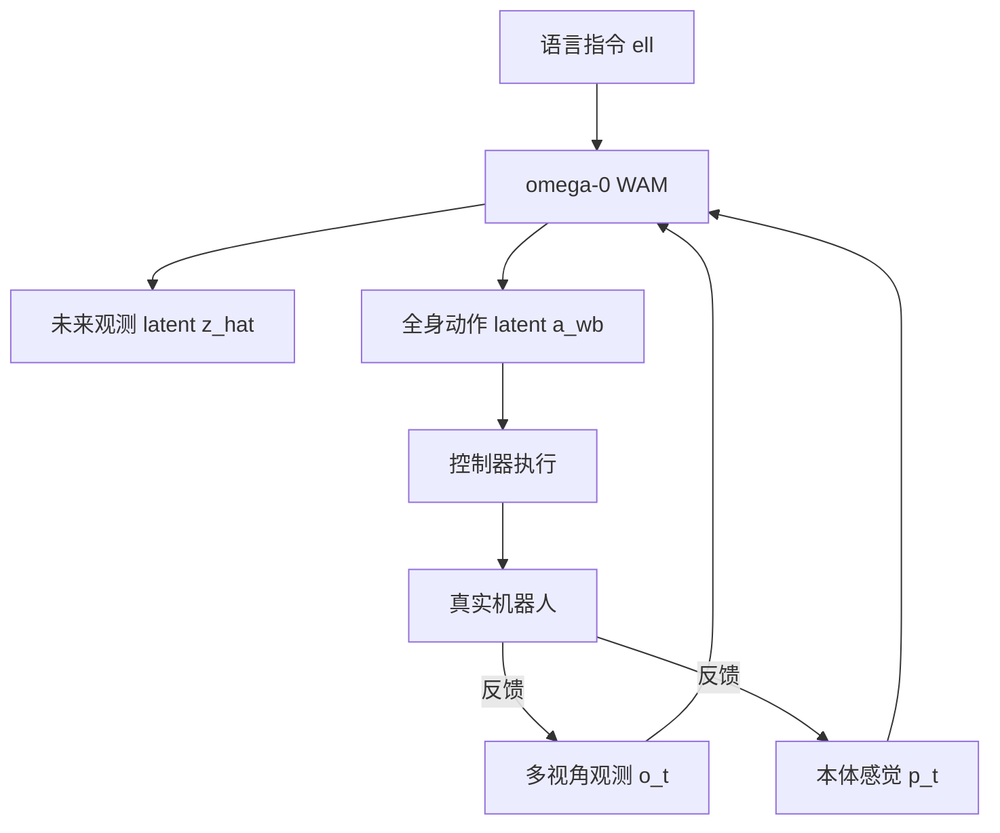

# 2026 年 8 月人形世界动作模型：ω-0 与 GigaBrain-WBC-0.5

> 作者：Damon Li | 更新日期：2026年8月22日
> 证据状态：预印本（arXiv）

## 1. 结论与证据等级

ω-0 和 GigaBrain-WBC-0.5 代表世界动作模型从桌面操作扩展到人形机器人全身控制。ω-0 是面向人形并发 locomotion-manipulation 的 latent predictive whole-body world-action model，配套 40+ 小时家庭场景数据集 ω-HOME；GigaBrain-WBC-0.5 提出行为世界模型（Behavior World Model）解决全身控制在复杂接触和地形条件下的鲁棒性。[1] [2]

| 工作 | 核心问题 | 方法 | 证据等级 | 开源状态 |
| :--- | :--- | :--- | :--- | :--- |
| ω-0 | 人形并发 loco-manipulation 的统一策略 | latent predictive WAM + diffusion action + ω-HOME 数据集 | A | 代码/数据未确认 |
| GigaBrain-WBC-0.5 | WBC tracker 在复杂接触/地形下失效 | Behavior World Model + 环境交互行为建模 | A | 代码未确认 |

## 2. 问题设定、符号与假设

### 2.1 符号表

| 符号 | 含义 |
| :--- | :--- |
| $o_t$ | 观测（egocentric RGB / exocentric RGB / exocentric depth） |
| $p_t$ | 机器人本体感觉状态 |
| $\ell$ | 语言指令 |
| $a_t^{\mathrm{wb}}$ | 全身动作 latent |
| $\hat{z}_{t+1}$ | 未来观测的 compact embedding |
| $W_\phi$ | 世界动作模型 |
| $\mathcal{D}_{\omega\text{-HOME}}$ | ω-HOME 数据集（40+ 小时） |

### 2.2 ω-0 的核心问题

人形家庭任务要求并发 loco-manipulation：机器人需要同时移动、调整姿态、保持平衡并操作物体。现有策略通常解耦 locomotion 和 manipulation，而世界动作模型要么以手臂为中心，要么以视频为中心。[1]

### 2.3 GigaBrain-WBC-0.5 的核心问题

现有全身控制 tracker 多在空旷平地训练，难以处理地形变化和物体接触。行为世界模型旨在通过环境交互中的行为建模提升鲁棒性。[2]

## 3. 方法与完整推导

### 3.1 ω-0：Latent Predictive Whole-Body WAM

ω-0 不重建未来视频，而是学习 compact future observation embedding 作为轻量预测目标，并将 latent visual foresight 与 diffusion-based 全身动作生成耦合。

**预测目标**：

$$
\hat{z}_{t+1} = W_\phi^{\mathrm{pred}}(o_t, p_t, \ell, a_t^{\mathrm{wb}})
$$

其中 $\hat{z}_{t+1}$ 是未来观测的 compact embedding（不重建像素）。

**动作生成**：

$$
a_{t:t+H}^{\mathrm{wb}} = W_\phi^{\mathrm{action}}(o_t, p_t, \ell, \hat{z}_{t+1})
$$

动作生成采用 diffusion-based 方式。

**联合训练目标**：

$$
\mathcal{L}_{\omega\text{-}0} = \underbrace{\| \hat{z}_{t+1} - \mathrm{sg}(z_{t+1}) \|_2^2}_{\text{latent foresight}} + \lambda \underbrace{\mathcal{L}_{\mathrm{diff}}(a_{t:t+H}^{\mathrm{wb}})}_{\text{全身动作扩散}}
$$

其中 $z_{t+1}$ 是目标 future observation embedding（通过 stop-gradient $\mathrm{sg}$），$\mathcal{L}_{\mathrm{diff}}$ 是扩散去噪损失。

**控制器仿真重放**：ω-0 利用 controller-based simulation replay 将人类/公开视觉-运动先验 grounding 为机器人可执行的动作 latent。

### 3.2 GigaBrain-WBC-0.5：Behavior World Model for WBC

行为世界模型建模机器人与环境交互中的行为：

$$
\hat{b}_{t+1} = B_\phi(s_t, a_t^{\mathrm{wb}}, e_t^{\mathrm{env}})
$$

其中 $b_t$ 是行为状态（包括平衡、接触、运动意图），$e_t^{\mathrm{env}}$ 是环境交互信号。行为世界模型使 WBC tracker 能预测环境响应并提前调整控制策略。

## 4. 训练和推理算法

| 工作 | 训练输入 | 训练目标 | 推理特点 |
| :--- | :--- | :--- | :--- |
| ω-0 | ω-HOME 40h 多视角数据 + 公开先验 | latent foresight + diffusion action | 直接输出 controller-compatible 全身动作 latent |
| GigaBrain-WBC-0.5 | WBC 训练数据 + 环境交互 | 行为预测 + WBC tracking | 预测环境响应并调整控制 |

### ω-HOME 数据集

| 属性 | 值 |
| :--- | :--- |
| 规模 | 40+ 小时 |
| 模态 | 同步多视角观测（egocentric RGB + exocentric RGB + exocentric depth） |
| 标注 | 全身 SMPL 运动 + 机器人状态 + 动作 latent |
| 场景 | 家庭场景 |
| 公开状态 | 未确认公开下载 |

## 5. 实验设计、基线与结果

| 维度 | ω-0 | GigaBrain-WBC-0.5 |
| :--- | :--- | :--- |
| 任务 | 11 个家庭任务（并发 loco-manipulation） | 全身控制（复杂接触/地形） |
| 基线 | IL、VLA、humanoid、WAM baselines | 标准 WBC tracker |
| 核心结果 | 单一模型生成平滑 manipulate-while-moving 行为；优于所有基线 | 复杂接触/地形下保持鲁棒控制 |
| 统计 | 论文报告成功率 | 论文报告控制指标 |
| 真机 | 真实人形机器人实验 | 需确认 |
| 复现 | 代码/数据未确认 | 代码未确认 |

## 6. 失败模式、局限性与复现条件

1. **ω-0 的 latent foresight 假设**：compact embedding 能否充分捕捉未来场景的关键物理信息（如接触位置、物体稳定性）尚需验证。若 embedding 丢失关键信息，动作生成可能基于不完整预测。
2. **并发 loco-manipulation 的安全约束**：论文未详细讨论平衡恢复机制和碰撞安全策略。
3. **ω-HOME 数据规模**：40 小时对于人形机器人家庭场景是重要补充，但相比 Xiaomi-Robotics-1 的 100K+ 小时仍属于小规模。
4. **GigaBrain-WBC-0.5 的行为定义**：行为状态 $b_t$ 的精确定义和标注方式论文未完整披露。
5. **开源状态**：两篇论文均未确认公开代码或数据。

## 7. 代码、模型、数据与许可证

| 资源 | ω-0 | GigaBrain-WBC-0.5 |
| :--- | :--- | :--- |
| 论文 | [arXiv:2608.06375](https://arxiv.org/abs/2608.06375) | [arXiv:2608.18234](https://arxiv.org/abs/2608.18234) |
| 代码 | 未确认 | 未确认 |
| 数据 | ω-HOME（40h），未确认公开 | 未确认 |
| 许可证 | 未披露 | 未披露 |

## 8. 参考资料

[1]: https://arxiv.org/abs/2608.06375 "ω-0: A Latent Predictive World Action Model for Concurrent Humanoid Loco-Manipulation"
[2]: https://arxiv.org/abs/2608.18234 "GigaBrain-WBC-0.5: A Behavior World Model for Robust Whole-Body Control with Environment Interaction"
