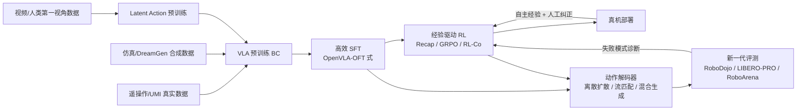

# 2025 年中—2026 年 8 月 VLA 训练范式与评测基准突破：从行为克隆到经验驱动学习

> 作者：Damon Li | 更新日期：2026年8月22日
> 证据状态：预印本（arXiv / OpenReview）+ 公司官方披露（B 级单独标注）

## 1. 结论与证据等级

2025 年下半年至 2026 年 8 月，VLA 训练出现了四个范式级转变：**(1)** 预训练数据从遥操作机器人轨迹扩展到 latent action 视频预训练、UMI 规模真实数据（10 万小时级）与世界模型生成的 neural trajectories；**(2)** 后训练从纯行为克隆（BC）进入"RL + 人工纠正 + 自主经验"阶段，代表作为 Physical Intelligence 的 Recap（π*0.6）；**(3)** 动作解码从自回归 token 走向离散扩散、离散流匹配与混合生成；**(4)** 评测从单一成功率排行榜转向扰动鲁棒性（LIBERO-PRO/Plus）、跨实验室成对真机评测（RoboArena）与 sim+real 统一基准（RoboDojo），并揭示了高成功率背后的记忆化问题。

| 方向 | 代表工作 | 核心主张 | 证据等级 |
| :--- | :--- | :--- | :--- |
| 经验驱动后训练 | Recap / π*0.6（Physical Intelligence） | 优势条件化 RL，真机经验使最难任务吞吐翻倍、失败率减半 | A（论文）+ B（官方博客） |
| 高效 SFT | OpenVLA-OFT（Stanford） | 并行解码 + 动作分块 + L1 回归，25—50× 推理加速，LIBERO 97.1% | A |
| Latent action 预训练 | UniVLA / villa-X / LAWM 系列 | 从视频帧转移学习 latent action，摆脱遥操作依赖 | A |
| 合成数据预训练 | DreamGen / InternData-A1 | 世界模型 neural trajectories / 纯仿真数据预训练逼近真实数据 | A |
| Sim-Real 协同训练 | RL-Co | 仿真 RL + 真实监督正则，防止 RL 策略漂移 | A |
| 动作链推理 | ACoT-VLA（北航 + AgiBot） | 显式/隐式动作推理器，动作链替代文本 CoT | A |
| 离散扩散动作解码 | Discrete Diffusion VLA / DFM-VLA / AsyncVLA | 动作分块的离散扩散与迭代精修 | A |
| 混合生成 | HybridVLA | 自回归 + 扩散统一训练，仿真 +17%、真机 +19% 平均成功率 | A（OpenReview） |
| 统一评测基准 | RoboDojo | sim+real 统一协议，能力维度分类，防刷榜机制 | A |
| 扰动鲁棒性 | LIBERO-PRO / LIBERO-Plus | 标准 LIBERO >90% 的模型在扰动下崩溃至近零 | A |
| 分布式真机评测 | RoboArena（Stanford 等 7 校） | 600+ 成对真机 rollout，跨实验室排名 | A |
| 自动真机评测 | AutoEval | 24 小时约 850 次无人值守评测，自动成功检测与复位 | A |
| 统一评测 harness | vla-eval | 13 个仿真基准统一协议，LIBERO 吞吐提升 47× | A |
| 端到端训练配方 | GR00T N1.7 / Helix 02 / LingBot-VLA 2.0 / GR-3 | 万小时级真实数据 + 仿真 + RL 的工业化配方 | B（官方披露） |

## 2. 问题设定、符号与假设

### 2.1 符号表

| 符号 | 含义 |
| :--- | :--- |
| $o_t, \ell$ | 观测（图像等）与语言指令 |
| $a_t, a_{t:t+H}$ | 单步动作与动作分块（chunk） |
| $\pi_\theta$ | VLA 策略，参数 $\theta$ |
| $z_t$ | latent action / 潜动作 token |
| $A^{\pi}(s,a)$ | 优势函数 |
| $v_\theta(\cdot)$ | flow matching 速度场 |
| $q_\phi$ | latent action 编码器（前向/逆向动力学） |
| $\mathcal{D}_{\mathrm{real}}, \mathcal{D}_{\mathrm{sim}}, \mathcal{D}_{\mathrm{video}}$ | 真实机器人、仿真与视频数据源 |

### 2.2 核心问题

- **数据瓶颈**：遥操作数据昂贵，OXE 级数据（约 1.4M 轨迹）无法覆盖开放世界；互联网视频没有动作标签。[3]
- **BC 天花板**：行为克隆只拟合示范分布，无法从失败与纠正中学习；部署后分布偏移使性能衰减。[1]
- **解码瓶颈**：自回归动作 token 推理慢（RT-2 式 3—5 Hz），扩散头与主干割裂。[7]
- **评测失真**：标准基准上 >90% 成功率可能来自轨迹记忆而非可泛化策略控制。[11]

## 3. 方法与完整推导

### 3.1 Latent Action 预训练：从视频中学习"动作"

UniVLA、villa-X、LAWM 等工作的共同骨架：用相邻帧变化定义 latent action $z_t = q_\phi(o_t, o_{t+H})$，并用逆向动力学解码回真实动作 $\hat{a}_{t:t+H} = d_\psi(z_t, o_t)$。训练目标为重构 + 量化：

$$
\mathcal{L}_{\mathrm{LAM}} = \mathbb{E}_{(o_t, o_{t+H}) \sim \mathcal{D}_{\mathrm{video}}} \left[ \| a_{t:t+H} - d_\psi(q_\phi(o_t, o_{t+H}), o_t) \|^2 \right] + \beta \, \mathcal{L}_{\mathrm{commit}}(z_t)
$$

预训练后的 VLA 先在视频上预测 $z_t$（学习物理因果与任务结构），再用少量机器人数据把 $z_t$ 对齐到本体动作空间。Xiaomi-Robotics-1 的"embodiment-free pretraining"（见 [7.14](./7.14-xiaomi-robotics-1-vla-2026.md)）与此同构：10 万小时 UMI 数据先学状态转移，再对齐本体与指令。[3]

### 3.2 Recap（π*0.6）：优势条件化的经验驱动 RL

Physical Intelligence 的 Recap（Reinforcement learning with Experience and Corrections via Advantage-conditioned Policies）是本轮后训练范式转变的标志性工作：[1]

1. 预训练通用 VLA $\pi_{0.6}$（含 offline RL 阶段）；
2. 真机部署中收集自主 rollout 与人类介入纠正（corrections）；
3. 训练分布式价值函数 $V(s)$，估计优势 $A(s,a)$；
4. 用**优势条件化**而非重要性采样来提取改进策略：

$$
\pi_{\theta}(a \mid s, g) \propto \pi_{\mathrm{ref}}(a \mid s) \cdot \exp\big( A(s, a) / \tau \big), \qquad \mathcal{L}_{\mathrm{Recap}} = -\mathbb{E}_{(s,a,\hat{A}) \sim \mathcal{D}_{\mathrm{exp}}} \left[ w(\hat{A}) \log \pi_\theta(a \mid s) \right]
$$

其中 $w(\hat{A})$ 是优势加权（高优势样本权重更大），$\mathcal{D}_{\mathrm{exp}}$ 混合自主经验与纠正数据。官方披露：最难任务吞吐提升 2 倍以上、失败率下降 2 倍以上（意式浓缩咖啡制作、纸箱组装、家庭洗衣折叠）。[1]

### 3.3 OpenVLA-OFT：高效微调的工程范式

OpenVLA-OFT 不改变预训练，仅替换微调配方：并行解码（parallel decoding）+ 动作分块 + 连续动作 L1 回归 + FiLM 语言注入：[2]

$$
\mathcal{L}_{\mathrm{OFT}} = \mathbb{E}_{(o, \ell, a_{t:t+H}) \sim \mathcal{D}} \left[ \| a_{t:t+H} - \hat{a}_\theta(o, \ell) \|_1 \right], \qquad \hat{a}_\theta = \mathrm{Dec}\big( \mathrm{FiLM}(h_{\mathrm{VLM}}, \ell) \big)
$$

相比自回归离散 token，L1 回归 + 并行解码把 7B 模型推理加速 25—50×，LIBERO 四套件平均成功率 97.1%（超过 π0、Octo、Diffusion Policy 等），并支持 ALOHA 双臂高频语言驱动控制。[2]

### 3.4 离散扩散与流匹配动作解码

Discrete Diffusion VLA 将动作分块离散化后，在统一 transformer 主干内做 mask-token 扩散解码：[7]

$$
q(a^{(k)} \mid a^{(0)}) = \mathrm{Cat}\big( a^{(k)};\, (1-\beta_k)\, \delta_{a^{(0)}} + \beta_k\, \delta_{[\mathrm{MASK}]} \big), \qquad \mathcal{L}_{\mathrm{DD}} = -\mathbb{E}_{k, a^{(0)}} \sum_{i \in \mathcal{M}_k} \log p_\theta(a_i^{(0)} \mid a^{(k)}, o, \ell)
$$

其中 $\mathcal{M}_k$ 是第 $k$ 步被掩码的位置集合；配合自适应解码与二次重掩码（secondary remasking）保证稳定性。DFM-VLA 进一步用离散流匹配学习 token 级概率速度场并做迭代精修 + 确定性校验；AsyncVLA 用独立 confidence rater 指导异步流匹配解码。HybridVLA 则把下一 token 预测与扩散去噪纳入同一 LLM 主干协同训练，并用协同动作集成机制融合两种预测，仿真平均成功率较此前 SOTA +17%、真机 +19%。[7] [8] [9] [10]

### 3.5 Sim-Real 协同与世界模型合成数据

- **DreamGen**：用视频世界模型生成 neural trajectories，再用逆向动力学（IDM）伪标注动作，与真实轨迹 1:1 混合训练或纯合成训练；不同轨迹类型按独立 embodiment 处理。[4]
- **InternData-A1**：声称高保真纯仿真数据预训练可接近官方真实数据模型（49 个仿真任务 + 5 个真实任务 + 4 个长程灵巧任务上验证）。[5]
- **RL-Co**：先用真实 + 仿真示范初始化，再做仿真 RL，同时用真实监督约束策略漂移：[6]

$$
\theta_{k+1} = \theta_k - \eta \nabla_\theta \big( \mathcal{L}_{\mathrm{RL}}^{\mathrm{sim}}(\theta) + \lambda \, \mathcal{L}_{\mathrm{BC}}^{\mathrm{real}}(\theta) \big)
$$

### 3.6 动作链推理（ACoT-VLA）

ACoT-VLA 用显式动作推理器（EAR）提出粗参考轨迹、隐式动作推理器（IAR）学习潜在动作推理，把"思考"从文本空间转移到动作空间，再由动作引导预测连接推理与最终策略。[12]

## 4. 训练和推理算法

| 工作 | 训练输入 | 训练目标 | 推理特点 |
| :--- | :--- | :--- | :--- |
| Recap / π*0.6 | 预训练数据 + 真机经验 + 纠正 | 优势加权 BC（advantage-conditioned） | 标准 VLA 推理，无额外开销 |
| OpenVLA-OFT | 任务示范（10—50 条级） | L1 回归 + 动作分块 | 并行解码，25—50× 加速 |
| Discrete Diffusion VLA | 示范 + 离散化动作 | mask 扩散重构 | 自适应步数 + 二次重掩码 |
| HybridVLA | 示范 | 下一 token 预测 + 扩散去噪协同 | 协同动作集成融合两种预测 |
| ACoT-VLA | 示范 + 粗轨迹标注 | 显式/隐式动作推理 + 动作引导 | 先推理动作链再执行 |
| RL-Co | 真实 + 仿真示范 + 仿真环境 | 仿真 RL + 真实 BC 正则 | 真实部署无 sim 依赖 |

## 5. 实验设计、基线与结果

| 维度 | Recap / π*0.6 | OpenVLA-OFT | HybridVLA | Discrete Diffusion VLA |
| :--- | :--- | :--- | :--- | :--- |
| 任务 | 咖啡制作、纸箱组装、洗衣折叠（真实家庭/商业环境） | LIBERO 四套件 + ALOHA 双臂 | 仿真 + 真机多任务 | 仿真操作基准 |
| 基线 | 纯 BC 微调的 π0.6 | π0、Octo、Diffusion Policy、MDT、Seer | 此前 SOTA VLA | 自回归/连续扩散头 VLA |
| 核心结果 | 最难任务吞吐 ≥2×、失败率 ≤1/2 | LIBERO 平均 97.1%，推理 25—50× 加速 | 仿真 +17%、真机 +19% 平均成功率 | 成功率显著提升（摘要口径） |
| 真机 | 是 | 是（ALOHA） | 是 | 部分 |
| 复现 | 未开源 | 代码与模型公开 | 未见公开权重 | 未见公开权重 |

评测侧的关键实证发现（均为 A 级论文证据）：

| 基准 | 发现 |
| :--- | :--- |
| LIBERO-PRO | OpenVLA、π0、π0.5 在物体/位置/语义/任务/环境扰动下成功率崩溃至近零；π0.5 在位置扰动的 LIBERO-Goal 上仅 0.38，OpenVLA 与 π0 为 0 |
| LIBERO-Plus | 七维扰动分析表明当代 VLA 鲁棒性脆弱，存在语言/视觉依从缺陷 |
| RoboDojo | 统一 sim+real 协议 + 能力维度分类（泛化/记忆/长程/精度/开放任务）；Xiaomi-Robotics-1 报告 13.93%（次优 8.80%，相对 +58.3%），GR00T-N1.7 在 ARX X5 上平均 5.9/1.7 |
| RoboArena | 7 所高校、DROID 平台、600+ 成对真机 rollout，排名比单点评测更可信 |
| AutoEval | 24 小时约 850 次自动评测，自动成功检测与场景复位，结果与人工真值高度一致 |
| vla-eval | 13 个仿真基准统一 harness（WebSocket/msgpack + Docker 隔离），LIBERO 评测吞吐提升 47× |

工业化训练配方对比（B 级官方披露，未独立复核）：

| 模型 | 机构 | 数据规模 | 要点 |
| :--- | :--- | :--- | :--- |
| GR00T N1.6 / 1.7 | NVIDIA | 约 3.2 万小时真实 + 8 千小时仿真 | Cosmos-Reason2-2B（Qwen3-VL 系）+ 32 层扩散 transformer；Isaac Lab 全身 RL |
| Helix 02 | Figure AI | 1,000+ 小时人类动作数据（System 0） | 单一神经网络像素到全身控制，替代 109,504 行手写 C++；4 分钟无复位洗碗机装卸 |
| LingBot-VLA 2.0 | Robbyant / 蚂蚁 | 9 万小时筛选为 5 万小时真机 + 1 万小时第一视角蒸馏，共 6 万小时 | 覆盖 20 种构型、17 个品牌；GM-100 上领先 π0.5 与 GR00T N1.7；RTX 4090 推理 <130ms |
| GR-3 / GR-RL | 字节 Seed | 未披露 | 网络视觉语言数据协同训练 + VR 人类轨迹微调；GR-RL 系鞋带 83.3% |
| Gemini Robotics 2 / ER 2 | Google DeepMind | 未披露 | 本地执行、多本体原生支持，<200 样本适配新本体 |

## 6. 失败模式、局限性与复现条件

1. **记忆化陷阱**：LIBERO-PRO 显示模型在关键任务条件变化时仍输出近乎相同的记忆轨迹；高排行榜分数不等于可泛化控制。[11]
2. **优势条件化的分布依赖**：Recap 的 $w(\hat{A})$ 依赖价值函数估计质量；在价值估计不准的新场景中，加权 BC 可能放大错误经验。[1]
3. **合成数据天花板的反证不足**：InternData-A1 的"纯仿真可替代真实预训练"结论目前只在特定任务族验证，长程灵巧任务仅 4 个，需更大规模复核。[5]
4. **离散扩散的步数-质量权衡**：步数少则精修不足，步数多则丧失并行解码的速度优势；secondary remasking 引入额外超参。[7]
5. **基准污染风险**：随着 RoboCasa/LIBERO 数据被普遍纳入预训练，"零样本"声明的可信度下降；RoboCasa365 的 composite-unseen split 是对策之一。[13]
6. **复现现状**：OpenVLA-OFT、AutoEval、vla-eval、LingBot-VLA 2.0 已开源；Recap、HybridVLA、GR-3、Helix 02、Gemini Robotics 2 未开放权重或代码。

## 7. 代码、模型、数据与许可证

| 资源 | 状态 | 入口 |
| :--- | :--- | :--- |
| OpenVLA-OFT | 开源代码 + 模型 | [项目页](https://openvla-oft.github.io/) |
| AutoEval | 开源代码 | [GitHub](https://github.com/zhouzypaul/auto_eval) |
| LingBot-VLA 2.0 | 开源代码 + 权重（HF/ModelScope） | [GitHub](https://github.com/robbyant/lingbot-vla-v2) |
| Xiaomi-Robotics-1 | 开源代码 + 后训练/评测 checkpoint（2026-08-03） | [GitHub](https://github.com/XiaomiRobotics/Xiaomi-Robotics-1) |
| MolmoAct / MolmoAct2 | 开源代码 + 数据（720 小时双臂） | [GitHub](https://github.com/allenai/MolmoAct) |
| AgiBot World Colosseo | 数据集 + 仿真平台 | [项目页](https://agibot-world.com/) |
| Recap / π*0.6 | 未开源 | [官方博客](https://www.pi.website/blog/pistar06) |
| GR00T N1.6 / 1.7 | 平台化发布，权重开放程度以官方仓库为准 | [NVIDIA Isaac GR00T](https://developer.nvidia.com/blog/develop-humanoid-robot-policies-end-to-end-with-nvidia-isaac-gr00t/) |

## 8. 参考资料

[1]: https://arxiv.org/abs/2511.14759 "π*0.6: a VLA That Learns From Experience"（官方博客：https://www.pi.website/blog/pistar06）
[2]: https://arxiv.org/abs/2502.19645 "Fine-Tuning Vision-Language-Action Models: Optimizing Speed and Success (OpenVLA-OFT)"
[3]: https://arxiv.org/abs/2607.15330 "Xiaomi-Robotics-1"
[4]: https://arxiv.org/abs/2505.12705 "DreamGen: Unlocking Generalization in Robot Learning through Neural Trajectories"
[5]: https://arxiv.org/abs/2511.16651 "InternData-A1: Pioneering High-Fidelity Synthetic Data for Pre-training Generalist Policy"
[6]: https://arxiv.org/abs/2602.12628 "Beyond Imitation: Reinforcement Learning-Based Sim-Real Co-Training for VLA Models (RL-Co)"
[7]: https://arxiv.org/abs/2508.20072 "Discrete Diffusion VLA: Bringing Discrete Diffusion to Action Decoding in Vision-Language-Action Policies"
[8]: https://arxiv.org/abs/2603.26320 "DFM-VLA: Iterative Action Refinement for Robot Manipulation via Discrete Flow Matching"
[9]: https://arxiv.org/abs/2511.14148 "AsyncVLA: Asynchronous Flow Matching for Vision-Language-Action Models"
[10]: https://openreview.net/forum?id=H1KDMNOKQn "HybridVLA: Collaborative Diffusion and Autoregression in a Unified Vision-Language-Action Model"
[11]: https://arxiv.org/abs/2510.03827 "LIBERO-PRO: Towards Robust and Fair Evaluation of Vision-Language-Action Models"（LIBERO-Plus: https://arxiv.org/abs/2510.13626）
[12]: https://arxiv.org/abs/2601.11404 "ACoT-VLA: Action Chain-of-Thought for Vision-Language-Action Models"
[13]: https://arxiv.org/abs/2607.04434 "RoboDojo: A Unified Simulation and Real-World Benchmark for Generalist Manipulation"（RoboArena: https://arxiv.org/abs/2506.18123；AutoEval: https://arxiv.org/abs/2503.24278；Colosseum V2: https://arxiv.org/abs/2605.27759；GR00T N1.6: https://developer.nvidia.com/blog/building-generalist-humanoid-capabilities-with-nvidia-isaac-gr00t-n1-6-using-a-sim-to-real-workflow/；Helix 02: https://www.figure.ai/news/helix-02；GR-3: https://seed.bytedance.com/zh/direction/robotics）
