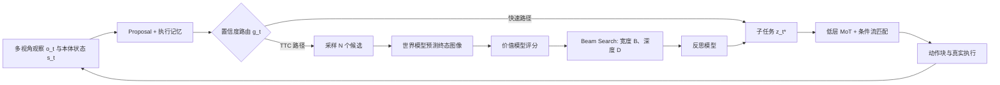

# τ₀-VLA：世界模型引导的分层测试时计算

> 作者：Damon Li
> 更新日期：2026年8月23日
> 证据状态：**A 级**。关键结论来自论文原文、官方项目页、官方实现与官方模型卡；推文仅作为发现线索。[1] [2] [3] [4]

## 1. 结论与证据等级

长程操作的主要失败源并不总是末端执行器的局部控制，而常常是“**此刻应执行哪个子任务**”的高层决策错误。若一个模型只做一次前向推理便提交子任务，错误通常会在动作改变环境之后才被发现。τ₀-VLA 将该决策改写为可按需扩展计算量的推理问题：置信度足够高时走快速路径；不确定时，对候选语言子任务执行“提议—预测—评估—反思”的世界模型搜索，再将所得子任务交给统一低层 VLA 执行。[1]

> 论文的关键边界是：公开实现已经发布低层 VLA、训练样例、适配器与 joint-control 服务，但高层 proposal/world/value/reflection 组件尚处于“逐步发布”状态。因此，本文将其高层 TTC 视为**论文可审计方法**，而非当前可端到端复现实装。[1] [2]

| 层级 | 输入与输出 | 公开状态 | 作用 |
| :--- | :--- | :--- | :--- |
| 高层策略 | 任务指令、观察、记忆 → 子任务 | 论文描述完整；核心 checkpoint 未完整公开 | 跟踪进度，在高不确定性时执行搜索 |
| 世界模型 | 头部 RGB + 子任务 → 预测终态图像 | 方法披露；权重未见公开 | 用物理后果而非纯语言比较候选 |
| 价值/反思模型 | 指令、候选、预测图像 → 分数/最终子任务 | 方法披露；权重未见公开 | 剪枝并在候选之外生成最终指令 |
| 低层 VLA | 多视角、状态、子任务、控制元数据 → 动作块 | 代码、权重、示例数据公开 | 跨本体连续控制 |



## 2. 问题设定、符号与假设

给定全局任务指令 $\ell$、多视角观察 $o_t$、本体状态 $\mathbf{s}_t$ 与控制元数据 $\eta$，系统须在长程执行中输出动作块 $\mathbf{a}_{t:t+H-1}$。本文以 $\mathcal{M}_t$ 表示执行记忆，$z_t^\star$ 表示当前子任务，$N$、$B$、$D$ 分别表示搜索分支数、beam width 与搜索深度。关键假设是：子任务级的视觉后果可以由世界模型近似预测，且价值模型对预测终态的排序与真实任务进度具有足够相关性。[1]

## 3. 方法与完整推导

### 2.1 分层接口与测试时计算

令全局指令为 $\ell$，观察为 $o_t$，本体状态为 $\mathbf{s}_t$，执行记忆为 $\mathcal{M}_{t-1}$，上一子任务为 $z_{t-1}^{\star}$。高层上下文写为：

$$
h_t=(\ell,\mathcal{M}_{t-1},z_{t-1}^{\star},o_t),\qquad
(z_t^{\mathrm{dir}},\mathcal{M}_t)=P(h_t).
$$

路由器从 proposal 的 token 置信度计算 $g_t\in\{0,1\}$。当 $g_t=0$ 时，直接采用 $z_t^{\star}=z_t^{\mathrm{dir}}$；当 $g_t=1$ 时，系统才调用搜索。这个设计的重要性在于，计算预算与**决策难度**而非固定控制频率绑定，从而避免所有时间步都承担世界模型搜索成本。[1]

对于一条候选分支 $b$，世界模型与价值模型分别计算：

$$
\hat{o}(b\oplus z)=\mathcal{W}(\tilde{o}(b),z),\qquad
v(b\oplus z)=V(\ell,z,\hat{o}(b\oplus z)),
$$

$$
S(b\oplus z)=S(b)+v(b\oplus z),\qquad
\mathcal{Q}_{t,d}=\operatorname{Top}_{B}(\mathcal{A}_{t,d},S).
$$

其中 $N$ 是每条保留分支的提议数、$B$ 是 beam width、$D$ 是搜索深度。该式揭示 TTC 的实际复杂度：根节点扩展 $N$ 次，后续每层至多扩展 $BN$ 次，近似为 $O(N+(D-1)BN)$ 次 proposal/world/value 调用。它不是对连续动作轨迹穷举，而是对子任务序列的后果进行稀疏搜索。[1]

### 2.2 统一动作空间中的掩码条件流匹配

低层策略将不同本体映射到 40 维共享状态/动作槽位，通过对角掩码 $\mathbf{M}$ 忽略不存在的通道。对动作块中第 $j$ 个向量，论文采用从干净动作到高斯噪声的线性路径：

$$
\mathbf{a}_{t+j}^{\tau}=\tau\mathbf{M}\boldsymbol{\epsilon}_{t+j}+(1-\tau)\mathbf{M}\mathbf{a}_{t+j},
\qquad
\mathbf{u}_{t+j}=\mathbf{M}(\boldsymbol{\epsilon}_{t+j}-\mathbf{a}_{t+j}),
$$

其中 $\tau\in[0,1]$，$\boldsymbol{\epsilon}\sim\mathcal{N}(0,I)$。模型预测速度场 $v_\theta$ 并只在有效维度最小化均方误差：

$$
\mathcal{L}_{\mathrm{CFM}}=
\mathbb{E}_{\tau,\mathbf{a},\boldsymbol{\epsilon}}
\left\|\mathbf{M}\odot\left(v_\theta(\mathbf{a}^{\tau},\tau,c)-\mathbf{u}\right)\right\|_2^2.
$$

最后一式是由论文给出的路径与速度目标进一步显式写出的掩码速度回归形式；其含义是“不让无效关节维度对不同本体的数据混合训练产生梯度污染”。推理时以数值积分沿逆时间轨迹把噪声动作块变为可执行动作。[1]

## 4. 训练和推理算法

低层训练使用约 40,115 小时异构真实机器人数据，混合人类演示、自主回放、UMI 风格记录和视觉语言数据。训练分三步：先进行 knowledge-isolated co-training（动作损失不回传骨干），再端到端联合训练，最后针对任务、本体、相机和成功条件进行小样本适配。高层 proposal 使用自动生成的阶段/子任务标注及记忆扰动样本；世界模型由子任务起止帧监督；value 把候选质量离散成五档并映射到 $[0.05,0.95]$；reflection 在离线 imagined rollout 上学习修正候选计划。[1]

| 审计维度 | 论文披露 | 评价 |
| :--- | :--- | :--- |
| 本体 | AGIBOT G1、ARX AC One、双臂 Franka Research 3 | 覆盖移动操作、双臂与固定基座，跨本体验证较完整 |
| 长程任务 | Clean Room（25 步，约 8 分钟）、Prepare Ingredients（14 步）、Tomato and Egg Stir Fry（22 步，约 10 分钟）、Make Milk Tea（13 步） | 按步骤、时长和里程碑定义，避免仅用短回合挑选成功片段 |
| 主要指标 | Success Rate（全部里程碑完成）与 Progress（里程碑分级计分） | SR 与进度同时报告，可区分“几乎完成”与真正成功 |
| 真机试验 | 每个 method–task 设置 10 次独立物理机器人试验 | 样本量有限，适合趋势判断；论文未给出置信区间 |
| 对照 | GR00T N1.7、LingBot-VLA、$\pi_{0.5}$、直接执行 τ₀-VLA、分层 Plan Once | 保持低层接口固定以隔离高层分解收益 |
| 消融 | 执行记忆、TTC、推理预算、Book Organization 的 ID/OOD 初始状态 | 对“为何提升”而非只报总体分数进行了分解 |

## 5. 实验设计、基线与结果

在四项主任务中，直接 τ₀-VLA 平均 SR 为 27.5%，加入分层 Plan Once 后为 45.0%；Make Milk Tea 在启用 TTC 时报告为 7/10、95.38% progress。这里应注意：这些是任务相关的 10 次试验计数，不应外推为通用世界模型成功率。[1]

## 7. 代码、模型、数据与许可证

官方仓库使用 Python 3.11、CUDA 12.8、PyTorch 2.7.1，提供数据格式、LeRobot 加载、训练脚本、机器人适配器模板、部署服务与 open-loop evaluation。公开 v1 仅支持 joint-control checkpoint；原生 EEF 数据可以训练，但 EEF serving 尚未开放。代码与模型权重为 Apache-2.0；示例 AgiBot World 子集在 `example_data/` 中，并需遵守其自身数据许可。[2] [3]

```bash
# 官方推荐的最小环境与示例后训练入口
bash scripts/setup.sh
bash scripts/train.sh configs/example_agibot_world_gong/train.yaml \
  --model_name_or_path /path/to/tau-0-vla-checkpoint
python -m deploy.server --model outputs/<run_name>
python deploy/openloop.py --ckpt outputs/<run_name> --no-plot
```

| 资源 | 链接 | 可获得内容 | 使用前检查 |
| :--- | :--- | :--- | :--- |
| 论文 | [arXiv:2608.16885][1] | 方法、推导、真机协议 | 预印本，尚非同行评审版本 |
| 项目页 | [τ₀-VLA 项目页][4] | 演示与总览 | 适合作为导航，不替代论文实验表 |
| 代码 | [sii-research/tau-0-vla][2] | 训练、部署、适配器、样例 | 高层组件的公开范围需以仓库 README 为准 |
| 模型 | [Hugging Face 模型卡][3] | 低层 checkpoint 与许可 | 确认控制模式、动作归一化与本体 adapter |

## 6. 失败模式、局限性与复现条件

τ₀-VLA 的核心主张是“在不确定的高层决策上扩大测试时计算”，并非证明世界模型长期滚动预测必然可靠。世界模型只接受单张头部 RGB 图像，搜索深度增加会累积视觉预测误差，value 也可能偏好看似合理却不可执行的子任务。此外，10 次真机试验不足以稳健刻画罕见故障的方差。将其迁移到新本体时，必须验证 40 维动作槽位、控制元数据、执行频率和安全约束是否严格一致。

## 8. 参考资料

[1]: https://arxiv.org/html/2608.16885v1 "τ₀-VLA: a Hierarchical Robot Foundation Model with World-Model-Guided Test-Time Computation"
[2]: https://github.com/sii-research/tau-0-vla "τ₀-VLA 官方实现"
[3]: https://huggingface.co/sii-research/tau-0-vla "τ₀-VLA 官方模型卡"
[4]: https://tau0-vla.github.io/ "τ₀-VLA 官方项目页"
