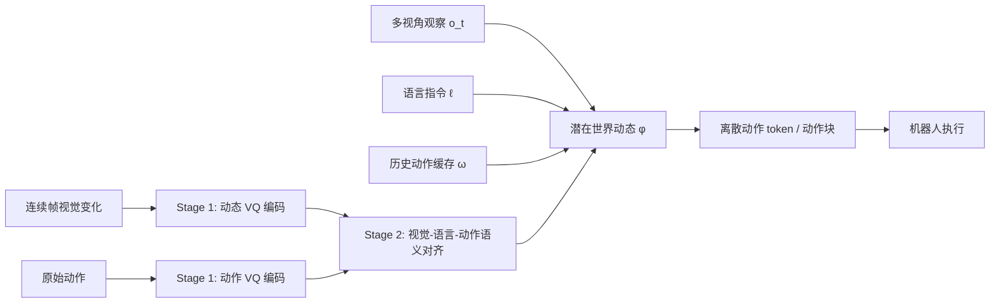

# Lumo-2：潜在世界—动作模型与渐进式模态预对齐

> 作者：Damon Li
> 更新日期：2026年8月23日
> 证据状态：**A/B 级**。理论、训练与实验来自技术报告和公司官方项目页；代码、权重、训练数据与 SDK 均未见公开发布。[1] [2]

## 1. 结论与证据等级

传统 VLA 往往直接从当前图像、语言和本体状态生成动作；而纯视频世界模型又可能把大量计算浪费在像素级细节。Lumo-2 提出在两者之间学习一个动作相关的潜在世界动态 $\phi$：先在 latent space 表示“此动作可诱导的物理未来”，再据此生成动作。其核心论点是：**仅追求动作 token 的重建误差，会让表征偏向低层波形保真，而不保证控制所需的语义几何结构**；因此需先让动作与世界动态、视觉、语言逐级对齐。[1] [2]

该模型属于“世界—动作模型（WAM）”路线，而非显式文本规划器。论文并未声称在像素空间生成完整未来视频；官方页面明确其目标是以更轻量的 latent dynamics 捕捉与控制相关的未来物理变化。[2]

## 2. 问题设定、符号与假设

给定机器人观测 $\mathbf{o}_t$、语言指令 $\ell$、历史动作缓存 $\boldsymbol\omega_{t-H':t}$ 与未来动作块 $\mathbf{a}_{t:t+H}$，Lumo-2 学习潜在世界动态 $\phi$ 以消解部分可观测性。其基本假设是：来自连续视觉帧的隐变量能够在压缩后保留对控制足够的物理变化，并可与动作、视觉和语言对齐；该假设由消融和 benchmark 支持，但不是因果可辨识性证明。[1]

## 3. 方法与完整推导

### 2.1 从直接行为克隆到潜在世界条件策略

对数据集 $\mathcal{D}$ 中的动作块、观测和语言 $(\mathbf{a}_{t:t+H},\mathbf{o}_t,\ell)$，Lumo-2 的目标不是 $\pi_\theta(\mathbf{a}\mid\mathbf{o},\ell)$，而是先隐式推断物理动态 $\phi$：

$$
\max_\theta\;\mathbb{E}_{(\mathbf{a}_{t:t+H},\mathbf{o}_t,\ell)\sim\mathcal D}
\log\pi_\theta(\phi,\mathbf{a}_{t:t+H}\mid\mathbf{o}_t,\ell).
$$

为了缓解同一画面在不同执行阶段对应不同动作的部分可观测性，论文加入历史动作队列 $\boldsymbol\omega_{t-H':t}$：

$$
\max_\theta\;\mathbb{E}
\log\pi_\theta(\phi,\mathbf{a}_{t:t+H}
\mid\mathbf{o}_t,\ell,\boldsymbol\omega_{t-H':t}).
$$

其联合分布被分解为：

$$
\pi_\theta(\phi,\mathbf{a}_{t:t+H}\mid\mathbf{o}_t,\ell,\boldsymbol\omega)
=
\pi_\theta(\mathbf{a}_{t:t+H}\mid\mathbf{o}_t,\phi)
\pi_\theta(\phi\mid\mathbf{o}_t,\ell,\boldsymbol\omega).
$$

这个分解的工程含义是：高层 latent dynamics 承担语言、观察和短期历史的歧义消解，低层只需把当前观察与 $\phi$ 映射为动作。它不是因果识别的证明；$\phi$ 是否真正只编码 action-inducible dynamics，取决于后续重建、对比和跨模态约束是否足够有效。[1]

### 2.2 三阶段对齐为何可能改善控制

| 阶段 | 学习对象 | 主要约束 | 要解决的失败模式 |
| :--- | :--- | :--- | :--- |
| Stage 1 | 视觉动态 latent $\phi$ 与动作 latent $A$ | 双分支 VQ 编码、特征融合、动作重建 | 视频变化掺入光照/背景等与动作无关信息；动作 VQ 缺乏环境上下文 |
| Stage 2 | 动作、视觉、语言语义空间 | 语义增强、多任务、跨模态预测/对比/判别 | 动作 token 可重建却难被语言或视觉语义定位 |
| Stage 3 | VLM、视频与机器人数据 | world-dynamics 预测与动作生成联合训练 | 预训练知识、物理动态与连续控制相互割裂 |

Stage 1 的关键耦合是将动态 latent 注入动作解码器：

$$
\widehat{\mathbf a}=D_A(A,\phi),
\qquad
\phi\rightarrow A\;\text{（提供全局物理上下文）},\quad
A\rightarrow\phi\;\text{（抑制无关视觉变化）}.
$$

上式表达了论文的“指导—正则化”直觉。为避免过度解读，需要强调：报告展示了多项消融与扩展性证据，但没有给出对 $\phi$ 因果充分性或可辨识性的数学证明；latent 是否对新接触类型保真仍应通过独立真机压力测试验证。[1]

### 2.3 Block-wise Autoregression（BAR）

标准自回归要逐 token 解码。Lumo-2 将语义动作 token 分成块，并以 block-wise causal mask 允许块内双向注意、块间保持因果关系。若原来需 32 次 token 解码、每块有 $k$ 个 token，则有效解码轮数近似从 $32$ 降为 $32/k$；但真实加速还受 VLM prefill、运行时调度与 KV cache 限制。论文在单张 RTX 5090、vLLM、BF16 与 FlashAttention-2 条件下报告：BAR 端到端 93.53 ms，标准 AR 为 253.66 ms，约 $2.71\times$ 加速；其中动作生成从 192 ms 降至 44.96 ms。[1]

## 4. 训练和推理算法

论文以 Qwen3.5-4B 为骨干。Stage 2 在 64 张 H100 上训练 12,000 steps；Stage 3 在 160 张 H100 上训练 120,000 steps，采用 8,192 token 最大长度、动态图像分辨率、AdamW 与余弦学习率调度。项目页还声明支持来自 VLM、互联网视频、第一人称视频与多机器人演示的异构协同训练。[1] [2]

| 审计项 | 已披露信息 | 复现判断 |
| :--- | :--- | :--- |
| 基础模型 | Qwen3.5-4B | 可识别，但完整训练配置不等于可复现模型 |
| 数据组成 | 约 5,300 万 VLM 样本；公开原始数据集清单；视频、第一人称和机器人数据混合 | 清洗、采样权重、私有机器人数据和全量 manifest 未公开 |
| 真机任务 | 时间推理、物理理解、长程和高精度灵巧操作等三类 | 官方项目页展示任务类别；完整每任务原始轨迹未公开 |
| 基准 | BLINK、CV-Bench、Ego-Plan2、VSIBench 等 | 论文给出统一 lmms-eval 配置，仍需复查版本与预处理 |
| 统计 | 报告部分 benchmark 表、消融和 OOD 对比 | 需以论文中具体表/附录为准；项目页视频不能替代统计试验 |
| 开源 | 未发现官方 GitHub、Hugging Face 权重、可下载训练数据或硬件 SDK | 目前只适合作为理论复现与披露审计对象 |

## 5. 实验设计、基线与结果

真实部署层面，报告强调时间推理、物理理解与高控制复杂度任务，且将少样本适应、人到机器人迁移和 OOD 泛化作为研究问题。结论应限定为“在作者所定义的测试集与任务设置下优于其选定基线”，不能将公司演示视频扩展为独立泛化证明。[1] [2]

## 7. 代码、模型、数据与许可证

Lumo-2 对课程知识库的价值在于，它清晰地给出 VLA/WAM 之间的一种设计折中：不从像素重建一切，也不把动作直接压缩为孤立 token，而是让世界动态 latent 成为训练与推理中的显式中介。对研究者而言，可复现实验可从以下三项开始：第一，固定视觉骨干、比较“无 $\phi$ / 有 $\phi$”的动作行为克隆；第二，比较 reconstruction-only action VQ 与加入跨模态对齐的 token；第三，控制 token 数、上下文长度和块大小，测量延迟—成功率曲线而非只报平均成功率。

| 资源 | 链接 | 状态 |
| :--- | :--- | :--- |
| 技术报告 | [arXiv:2607.11270][1] | 可读全文与 TeX；CC BY 4.0 |
| 官方项目页 | [Astribot Lumo-2][2] | 方法总览、实验叙述与演示 |
| 代码/权重 | 未发现官方公开入口 | **未公开**，不应把二手仓库误标为官方实现 |
| 数据 | 报告列出多种公开原始数据集 | 全量训练 manifest、处理脚本、私有数据比例未披露 |

## 6. 失败模式、局限性与复现条件

Lumo-2 的高质量技术报告披露了公式、训练阶段和大量实验，但它目前仍是预印本与公司研究发布，缺乏独立同行评审和可执行的端到端开源包。潜在动态空间可提高效率，也可能压缩掉接触瞬态、夹爪滑移等精细控制变量。要评估其产业可部署性，至少需要公开模型权重、数据许可与来源、随机种子、真机 reset/失败定义、每任务 trial 数及 failure trajectory。

## 8. 参考资料

[1]: https://arxiv.org/html/2607.11270v1 "Towards Predictive, Aligned, and Scalable Robot Learning"
[2]: https://www.astribot.com/research/Lumo2 "Lumo-2 官方项目页"
