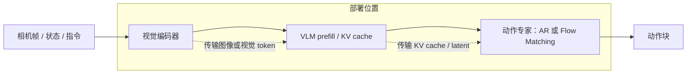

# VLA-Perf：从 Roofline 模型到机器人 VLA 的部署决策

> 作者：Damon Li
> 更新日期：2026年8月23日
> 证据状态：**A 级**。方法、参数与脚本均由论文和 NVIDIA Research 官方仓库交叉核验。[1] [2]

## 1. 结论与证据等级

VLA 的任务成功率无法直接说明是否能部署在真实机器人上。视觉帧率、网络抖动、动作块大小、扩散去噪步数和模型放置位置共同决定闭环延迟。VLA-Perf 不训练或评测新策略，而是建立一个可配置的分析型性能模型，对任意“模型架构 × 硬件 × 网络 × 部署位置”组合估计推理时间与吞吐率。论文将 10 Hz 视为可接受实时性、100 Hz 视为高性能目标，但这是其分析约定，不是对所有接触任务的普适安全阈值。[1]

| 它能回答 | 它不能回答 |
| :--- | :--- |
| Pi0/OpenVLA 类架构在哪种 GPU、网络和动作块配置下可能满足延迟预算 | 模型动作是否安全、是否成功、是否鲁棒 |
| 扩散/流匹配与自回归在不同 chunk size 下的性能趋势 | 真机端到端闭环的全部软件开销、传感器时延和控制器抖动 |
| 端侧、边缘服务器、云端与 split inference 的理论部署上界 | 某个模型在未建模硬件上必然达到同一性能 |

## 2. 问题设定、符号与假设

给定模型组件集合 $\mathcal M$、数据移动阶段 $\mathcal D$、硬件参数 $h$ 与网络参数，VLA-Perf 预测最优软件实现下的推理时延，而不预测任务成功率。本文用 $T_m$ 表示组件时延、$T_d$ 表示传输时延、$\mathrm{FLOP/s}_h$ 与 $\mathrm{MemBW}_h$ 表示硬件峰值。核心假设是单算子可由 Roofline 上界近似，且模型组件间的传输可由带宽与基础延迟近似。[1]

## 3. 方法与完整推导

### 2.1 端到端时延分解

令 $\mathcal M$ 是视觉编码器、VLM 骨干、动作专家等模型组件，$\mathcal D$ 是组件间的数据移动阶段。VLA-Perf 从：

$$
T_{\mathrm{total}}=
\sum_{m\in\mathcal M}T_m+
\sum_{d\in\mathcal D}T_d
$$

开始。组件 $m$ 的时间是算子时间之和：

$$
T_m=\sum_{o\in\mathcal O_m}T_o,
\qquad
T_o=\max\left(
\frac{\mathrm{FLOPs}_o}{\mathrm{FLOP/s}_h},
\frac{\mathrm{Bytes}_o}{\mathrm{MemBW}_h}
\right).
$$

这就是 Roofline 上界：算子不是算力受限，就是内存带宽受限。若跨设备传输 $\mathrm{Bytes}_d$，网络时延为：

$$
T_d^{\mathrm{net}}=\mathrm{NetLat}+
\frac{\mathrm{Bytes}_d}{\mathrm{NetBW}}.
$$

因此，部署优化不能只看 GPU 的峰值 FLOPS。长上下文会增大 VLM prefill，低带宽网络会放大 split inference 的传输项，而扩散动作专家的多步去噪会反复消耗 action-head 的计算预算。[1]



### 2.2 为什么动作分块和生成范式重要

自回归动作头每次解码一个 token，若动作块长度为 $H$，大致需要 $H$ 次依赖性 decode；扩散/Flow Matching 动作专家在每次去噪中可并行更新多个动作维度或 token，但需要 $K$ 次迭代。简化地说：

$$
T_{\mathrm{AR}}\approx T_{\mathrm{prefill}}+H\,T_{\mathrm{decode}},
\qquad
T_{\mathrm{diff}}\approx T_{\mathrm{prefill}}+K\,T_{\mathrm{parallel\;step}}.
$$

这不是断言扩散总是更快：若 $K$ 太大、动作块很短或 KV cache 传输成为瓶颈，优势可能消失。VLA-Perf 的价值正是将这类取舍扫入同一模型，而非只比较一组孤立基准。[1] [2]

## 4. 训练和推理算法

官方仓库提供 Pi0 的 7 个实验：基础端到端性能、模型缩放、长上下文、去噪步数×动作长度、自回归与扩散对比、端侧/服务器选择、端侧—服务器协作。Pi0 例配置包括 SigLIP SoViT-400m 视觉编码器、Gemma 2B VLM、约 300M 的 flow-matching 动作专家；OpenVLA 则作为自回归基线。[2]

| 项目 | 论文披露 | 解释方式 |
| :--- | :--- | :--- |
| 性能验证 | RTX 4090 上 1/2/3 相机设置，10 个 flow-matching steps、63 长度动作块 | Roofline 预测 14.7/22.5/30.4ms，对应真实 Triton 为 20.0/27.3/36.8ms |
| 保真度 | 真实实现达预测上界的 73.3%–82.6% | 正确表述应是“优化实现接近理论上界的比例”，不是模型准确率 |
| 硬件 | A100/H100/B100、RTX 4090、Jetson 系列 | 硬件配置是分析参数，非所有平台均做实机全栈部署 |
| 网络 | Wi‑Fi、蜂窝、以太网与云链路 | 网络模型基于带宽与单向基础时延，未完整涵盖生产网络抖动 |
| 任务性能 | 不报告抓取或任务成功率 | 必须与策略准确性/安全性测试组合使用 |

## 5. 实验设计、基线与结果

论文明确指出 Roofline 假设理想软件实现，未建模核启动、OS 干扰、底层 kernel 效率和真实机器人执行延迟；所以它应被用作**设计空间筛选器**，而不是 SLA 承诺器。[1]

## 6. 失败模式、局限性与复现条件

VLA-Perf 以 Pi0 和 OpenVLA 为中心，不能自动代表使用视觉 token 压缩、MoE、异步双系统或人形高自由度动作空间的所有新模型。其单加速器组件假设、网络常数项和 Roofline 近似尤其值得在生产环境复测。尽管如此，该工作为具身系统提供了重要的工程方法论：**将模型结构和部署系统共同作为设计变量**，并把“足够实时”定义为与感知更新、动作 chunk 和安全恢复相匹配的端到端预算。

## 7. 代码、模型、数据与许可证

官方仓库采用 Apache-2.0，并把 GenZ LLM Analyzer 纳入作为硬件建模后端。运行 `pi0_perf.py` 可复现论文所述 7 组分析，并在 `perf_results/`、`paper_figures/` 与 `paper_tables/` 生成结果。它不需要下载巨型 VLA checkpoint，因为核心是配置和解析计算模型；但用户必须自己判断硬件规格、精度、batch、序列长度与部署链路是否贴近目标系统。[2]

```bash
conda create -n vla-perf python=3.10
conda activate vla-perf
cd genz && pip install -e .
cd ../vla-perf
python pi0_perf.py
```

建议的工程工作流是：先用 VLA-Perf 扫描 $H,K$、上下文长度、边缘 GPU 和网络带宽，再在候选区间部署真正的推理栈，通过 trace 测量相机采集、预处理、排队、模型、网络、控制器与执行器时延。最后把性能曲线与任务 SR、碰撞率、接触质量联合评估；只优化 token/s 可能反而扩大动作过时风险。

## 8. 参考资料

[1]: https://arxiv.org/html/2602.18397v1 "How Fast Can I Run My VLA? Demystifying VLA Inference Performance with VLA-Perf"
[2]: https://github.com/NVlabs/vla-perf "VLA-Perf 官方代码"
