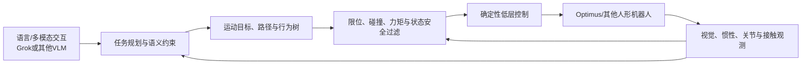

# Tesla Optimus、Terafab、AI5 与 Grok：产业主张的一手来源核验

> 作者：Damon Li
> 更新日期：2026年8月22日
> 关联线索：[微信公众号入口](https://mp.weixin.qq.com/s/XoIIN-eR59nebjTx4m4zDA)

## 1. 核验结论摘要

输入材料将 Tesla Optimus、Terafab、AI5 芯片和 Grok 描绘为同一条“具身智能大脑”路线。经一手来源核验，可以确认 Tesla 的 **AI & Robotics** 页面明确将 Optimus 定义为通用双足自主机器人，并把平衡、导航、感知与物理交互列为核心软件栈；同时，Tesla 明确强调定制推理硬件、视觉网络、世界表征与轨迹规划的协同。[1] xAI 官方页面则确认 Grok 提供文本、代码、语音、图像与视频能力以及统一 API。[2]

但关于 Terafab 的投资金额、总算力、Optimus 占用比例、AI5 性能倍数、全面量产日期，以及 Grok 已经直接承担机器人高频底层控制等具体说法，在本次可访问的 Tesla 财报、产品页、官方 AI 页面和 xAI 页面中均未得到完整、可重复的量化确认。因此本文将其列为**待核验产业主张**，而非技术事实。

| 事项 | 本次一手证据 | 可写入的结论 | 不应写入的结论 |
| :--- | :--- | :--- | :--- |
| Optimus | Tesla AI & Robotics 官方页 | Tesla 正在面向通用双足自主机器人开发平衡、导航、感知与物理交互软件栈。 | 已达到通用家庭/工厂部署能力或某一量产时间。 |
| 定制推理硬件 | Tesla 官方页 | Tesla 为 FSD / AI 推理优化性能功耗，并强调软硬协同。 | AI5 的具体 PPA、量产节点或相对 AI4 的倍数。 |
| Terafab | 可检索到 Tesla 职位标题，正文未完整公开 | 存在名为 Terafab 的相关招聘/组织线索。 | 建设地点、投资额、产能、1TW 算力等数字。 |
| Grok | xAI 官方页 | Grok 为多模态模型和 API 产品，支持文本、代码、语音、图像、视频。 | 已被公开证实为 Optimus 端侧实时运动控制器。 |

## 2. 真实机器人系统需要的“大小脑”边界

从工程架构看，语言模型或多模态模型可以提供任务意图解析、语义检索、失败说明和长时程任务分解；但它不应直接取代高频低层运动控制。一个更稳健的接口是：

$$
\text{language / vision} \rightarrow \text{task plan} \rightarrow \text{motion targets} \rightarrow \text{safety-filtered control}.
$$

其中最后一层通常运行在更严格的时延与确定性约束下，需要关节限位、碰撞检查、状态估计、力/速度限制和紧急停止机制。Tesla 官方页面中“世界表征与轨迹规划”“高吞吐、低时延、正确性和确定性”的描述与此类系统分层相符，但页面没有公开 Optimus 的端到端控制网络、模型权重或可复现评测协议。[1]

## 3. 可用资源与研究启示

Tesla 的 AI 页面适合理解其公开的系统组织方式：视觉网络从多相机原始图像学习语义分割、目标检测和单目深度，再由鸟瞰网络输出道路、基础设施和三维对象表征；规划算法在表征空间中生成轨迹；评测基础设施使用开环、闭环和 hardware-in-the-loop 测试防止回归。[1] 虽然这些描述主要来自自动驾驶技术栈，仍能为具身系统的视觉—表征—规划—评测闭环提供参考。

xAI 的官方文档入口则适用于构建上层多模态助手或开发者原型，例如通过 API 处理自然语言任务说明、日志总结和远程运维问答。[2] 对物理执行而言，应将其输出限制在可校验的符号任务、操作对象和约束集合，并由机器人规划与安全模块拒绝不合法动作。

## 4. 后续核验清单

要把产业报道升级为可引用技术资料，至少需要补充以下一手证据：Tesla 年报、季度电话会或正式新闻稿中的 Terafab 资本开支/产能指标；AI5 的公开数据表或开发者文档；Optimus 在标准基准上的多次试验；Grok 与机器人控制接口的官方架构、时延和安全评测。取得这些材料前，不应将媒体数字写入课程知识库。

## 5. 参考资料

[1]: https://www.tesla.com/AI "Tesla AI & Robotics 官方页面"
[2]: https://x.ai/ "xAI 官方网站"
[3]: https://www.tesla.com/careers/search/job/silicon-program-manager-terafab-277833 "Tesla Silicon Program Manager, Terafab 招聘页（仅作为组织线索）"
