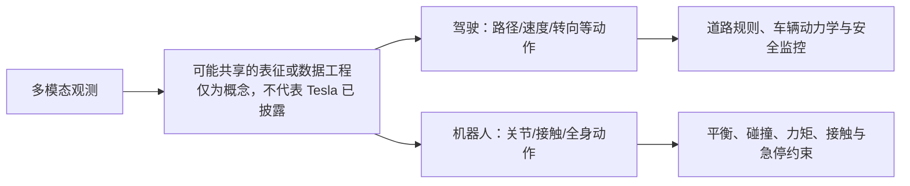

# Tesla、FSD、Optimus、Terafab、AI5 与 Grok：产业主张的证据边界核验

> 作者：Damon Li
> 更新日期：2026年8月23日
> 关联线索：[早期微信公众号入口](https://mp.weixin.qq.com/s/XoIIN-eR59nebjTx4m4zDA)、[本轮公众号入口](https://mp.weixin.qq.com/s/Q2uZgbOWf1-Xaey0Z5cf4Q)
> 核验状态：**B/C 级**。本文只记录 Tesla 官方 AI 页面与 ICCV 2025 WDFM-AD 工作坊页面直接可确认的内容；媒体、公众号与个人纪要只能作为发现线索。[1] [2]

## 1. 可确认结论

Tesla 的公开 AI 页面只给出高度概括的表述：公司在车辆、机器人及其他领域开发和部署自主性。ICCV 2025 WDFM-AD 工作坊页面确认 Tesla 的 Ashok Elluswamy 列为 keynote speaker，并将 workshop 定位为自动驾驶基础模型蒸馏、视觉语言模型、生成式 AI、运动预测与规划的学术交流场合。[1] [2]

这两项证据足以说明 Tesla 同时从事车辆自主性与机器人相关 AI 工作，也足以说明其技术人员参与自动驾驶基础模型的公开学术交流；但它们**不足以**证明 FSD 与 Optimus 使用同一模型、同一 VLA、同一世界模型或同一训练栈。

| 话题 | 可由本轮一手来源确认 | 当前不能确认 |
| :--- | :--- | :--- |
| Tesla AI 与机器人 | Tesla 宣称在车辆、机器人和其他领域开发/部署自主性 | Optimus 的具体感知、规划、控制或训练架构 |
| FSD 与基础模型 | 自动驾驶基础模型蒸馏是 WDFM-AD 讨论主题，Tesla 代表列为 keynote | FSD 已采用何种 VLA、参数量、损失函数、数据规模或 world-model 设计 |
| Optimus 与 FSD 的关系 | 两者均位于 Tesla 对外描述的 AI/自主性范围内 | 视觉骨干、token、数据、模型权重或控制接口完全共享 |
| AI5 / Terafab | 本轮已访问页面未提供可审计技术数据 | 芯片制程、PPA、量产节点、资本开支、算力、产能或具体项目关系 |
| Grok | 本轮证据未提供与 Optimus 控制栈的直接官方关联 | Grok 已经进入 Optimus、承担任务规划或高频控制 |

## 2. 为什么“自动驾驶端到端”不能自动等同于“机器人 VLA”

从问题形式看，自动驾驶和人形操作都可以抽象为从多模态观测 $x_t$ 到动作 $a_t$ 的映射：

$$
a_t=f_\theta(x_t,\text{context}).
$$

但动作空间、约束、感知与安全闭环显著不同。驾驶控制通常面向转向、制动、纵向速度和路径；人形机器人则面对高自由度关节、接触切换、平衡、手部操作、力/阻抗与碰撞约束。即使两个系统共享部分视觉预训练或数据工程，仍不能据此推导出“同一个 VLA”或“同一个世界模型”。任何这样的架构主张都需要原论文、公开演讲材料、技术白皮书、模型卡或开发者文档支持。

上图是通用工程边界示意，**不是** Tesla 系统图。对具身智能课程而言，正确的做法是把大模型或视觉模型的输出放在可审计的规划和安全接口之前，而不把公司愿景或媒体摘要改写成未披露的控制实现。

## 3. 本轮不能写成事实的传播性主张

以下内容目前没有从已访问 Tesla 官方页或 WDFM-AD 页面获得可审计证据，故在仓库中保持“待核验”，不进入模型/硬件参数表：

| 未证实主张类别 | 本轮处理 |
| :--- | :--- |
| FSD 与 Optimus 完全统一为某一 VLA | 不写入；需要 Tesla 的正式技术材料 |
| 固定相机数量、固定模型规模、特定 token/反思机制 | 不写入；不能由个人纪要或演示倒推出架构 |
| AI5 性能倍数、制程、成本、量产计划 | 不写入；需要数据表、财报、新闻稿或监管披露 |
| Terafab 的地点、投资额、产能、算力与 Optimus 分配比例 | 不写入；需要正式公司披露 |
| Grok 已接入 Optimus 高/低频控制链路 | 不写入；需要接口文档、论文、演讲原文或演示技术说明 |
| 世界模型闭环、安全评测或真机成功率 | 不写入；需要定义明确的任务、trial、指标和原始实验材料 |

## 4. 后续核验的最低证据门槛

若将来出现 Tesla 年报/正式新闻稿、公开论文、可访问 keynote 讲义、开发者文档或具备协议与统计的真实机器人评测，应该建立新文档并至少记录：模型输入输出、动作频率、训练数据来源和许可、验证任务、trial 数、成功/失败标准、延迟、硬件、软件版本与安全停止条件。在此之前，Tesla 相关讨论应作为产业线索，而不作为可复现实验结果。

## 5. 参考资料

[1]: https://www.tesla.com/AI "Tesla AI & Robotics 官方页面"
[2]: https://wdfm-ad.github.io/iccv25/ "ICCV 2025 Workshop on Distillation of Foundation Models for Autonomous Driving"
