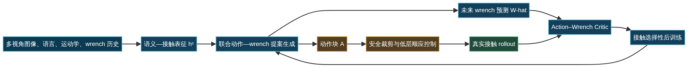
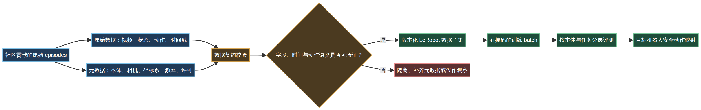

# 从接触预测到数据契约：具身智能的下一阶段，不是更大的模型

> 作者：Damon Li
> 发布日期：2026年9月2日
> 更新日期：2026年9月2日
> 阅读时间：约 12 分钟
> 依据：Facet-0 / ManuFacet-1K、LeRobot Community Dataset V3 的公开论文、项目页、模型/数据卡与官方框架仓库。

> **摘要**：今天值得关注的两项更新，并不在于又出现了一个“更大”的具身模型，而在于两条工程上更难、也更接近落地的主线开始收敛：其一，策略是否能在接触发生前预测后果，而不是撞上去再纠错；其二，数据是否有足够清晰的语义契约，使不同机器人采集的经验能够被安全、可审计地复用。Facet-0 将未来 wrist wrench 纳入动作提案与价值估计；LeRobot Community Dataset V3 则把社区异构数据的真实复杂性摊开在版本化数据卡上。二者共同指向一个朴素结论：**模型能力的上限，越来越由闭环质量与数据语义的下限决定。**

## 先说结论：今天的更新，解决的是两个长期被低估的接口

过去两年，具身智能讨论常围绕模型规模、视觉语言理解或“能否泛化”展开。但当系统进入插装、装配、接触操作和多机器人数据复用时，真正拖慢项目的通常不是主干网络少几个参数，而是两个接口没有被定义清楚。

第一个接口发生在**策略与物理接触**之间。纯视觉策略可以知道“插头大致在哪里”，却未必知道“下一毫米继续下压会是顺畅插入、侧向摩擦，还是卡在边缘”。第二个接口发生在**数据与本体**之间。来自不同机械臂、相机、控制器的 episode 即使都叫“抓取”，其动作坐标系、时间戳容差、夹爪语义和采样频率也可能并不兼容。

| 今日更新 | 它试图补齐的接口 | 架构上真正值得关注的点 | 不能据此得出的结论 |
|---|---|---|---|
| Facet-0 / ManuFacet-1K | 视觉—运动学策略与接触后果之间 | 将未来 wrench 与动作块联合建模，并以联合 proposal 的价值进行后训练 | 不是通用工业装配能力的证明，也不是经认证的力控安全系统 |
| LeRobot Community Dataset V3 | 多贡献者数据与下游策略训练之间 | 以版本化 schema、元数据、缺失模态和许可证问题暴露数据契约 | 不是跨 46 种本体已实现零样本泛化的证明 |

这种判断并不反对模型扩展。相反，它提醒架构团队：如果数据的动作语义没有被保留，或者接触反馈无法进入决策回路，更大的 backbone 往往只是在更快地学习已有误差。

## 一、Facet-0：把“接触会发生什么”变成策略可以比较的对象

Facet-0 面向的是电脑组件插装这类典型的 contact-rich precise manipulation：目标间隙窄、视觉外观相近、错误接触代价高。它的主张并不复杂，但方向是正确的：与其让策略只输出动作，再靠外部规则处理异常，不如让模型同时提出**动作序列**和该动作可能诱发的**未来六维 force/torque 轨迹**。[1] [2]

在论文的表述中，模型条件包括多视角图像、语言、末端运动学状态以及最近十步 wrench 历史；输出则是 50 步的 Cartesian 动作与未来 wrench 预测。重要的是，未来 wrench 并不直接发送给控制器。它是一条预测支路，用来帮助系统判断一组候选动作可能带来的接触质量。[1]

*图 1：Facet-0 的技术路径。图为基于论文公开机制绘制的解释图；它不表示作者给出了经过认证的安全闭环。*

从架构角度看，这相当于把传统的“策略 $\to$ 动作”接口扩展为“策略 $\to$ 动作及其物理后果假设”。可抽象为：

$$
p_\theta\left(A_{t:t+H-1},\widehat W_{t+1:t+H}\mid I_t^{1:3},\ell,s_t,W_{t-K+1:t}\right).
$$

其中，$A$ 是实际可执行的动作块，$\widehat W$ 是预测到的接触后果。Facet-0 以条件流匹配拟合联合变量，并在后训练阶段让 Action–Wrench Critic 学习判断不同 proposal 的回报分布。[1] 这并不自动带来因果保证，但它至少把“接触风险”从一个事后报警信号，前移成可以参与候选排序的变量。

### 这件事为什么比“多一个传感器”重要

许多机器人项目已经有 F/T 传感器，但它常被放在保护层：超过阈值就停，发生碰撞才回退。Facet-0 的启发是，wrench 也可以进入模型的**预测、估值和数据选择**环节。若未来预测显示力矩会沿异常方向增长，系统可以偏好另一个动作 proposal，而不是等阈值触发。

论文还用 VLM judge 产生子目标完成和接触相位信号，并通过接触强度加权的后训练，强化关键接触帧的学习。[1] 对工程团队而言，这里的重点不是照搬某个 reward，而是建立相位化数据语义：接近、接触、插入、锁止、恢复，每个阶段都应该有不同的观测、容差和失败定义。

| 传统做法 | 接触感知的改进方向 | 需要额外承担的工程成本 |
|---|---|---|
| 力阈值只用于急停或回退 | 预测未来 wrench，并以其评价动作候选 | 图像、状态和 F/T 的严格同步；接触标注与相位边界 |
| 把失败统一归为“未完成” | 区分错位、摩擦、卡滞、超力和恢复 | 需要可解释的失败 taxonomy 与日志管线 |
| 仅离线行为克隆 | 用 rollout 的接触后果做选择性后训练 | 需要受限的真机采样、安全过滤与可复现试验协议 |

### 结果值得看，但不要读得太快

Facet-0 在五项共享机箱夹具的电子装配任务中报告 82% 的平均成功率，作者实现的最强匹配基线为 15%，每个方法—任务单元为 20 次预先声明且不重跑的试验。[1] 这个信号足够强，说明“接触后果显式入模”值得认真跟踪；但它还不足以支持三个常见的过度外推。

首先，该结果来自有 wrist F/T、并联夹爪、多相机和特定 clearance 的装配环境，不等价于柔性物体、灵巧手或家庭长时序任务。其次，文中未见完整置信区间披露，20 次试验能说明趋势，不应被包装成行业级确定性。最后，模型和数据页是公开的，但独立训练代码、完整模型卡和端到端环境 recipe 尚未在项目入口中得到可核验的确认。[1] [2] [3] [4]

> 对架构决策者而言，正确问题不是“Facet-0 能否替换我们的装配系统”，而是“我们是否已经记录了足够同步、可追溯的接触数据，使策略有机会学到接触后果？”

## 二、LeRobot Community Dataset V3：数据规模的价值，取决于语义能否对齐

如果说 Facet-0 讨论的是一条 episode 内的物理闭环，LeRobot Community Dataset V3 讨论的则是跨 episode、跨贡献者、跨本体的数据闭环。官方数据卡显示，V3 聚合了 791 个数据集、50,622 个 episodes、约 25,971,082 个 frames、251.5 小时记录、235 位贡献者、46 种本体以及 12 种动作维度配置；其 API 在本轮扫描窗口内记录到 2026-08-30 的更新。[5] [6]

这组数字很容易被当成“大规模机器人数据”的又一个里程碑。更有价值的部分其实在数据卡的限制说明：缺视频、状态和动作 dtype 不统一、相机数量不同、时间戳容差不同，以及 split 文件格式带来的 viewer 兼容问题都被明确暴露出来。[5] 这是一份工程上诚实的数据卡，也揭示了“数据更多”与“数据可混训”之间的距离。

*图 2：跨本体数据并不天然可合并。图展示了把开放社区数据转化为可审计训练样本时应具备的最小数据契约。*

### 数据契约不是文档工作，而是策略性能的一部分

对于第 $e$ 条机器人 episode，可以把数据写为：

$$
\mathcal E_e=\left\{(o_{e,t},s_{e,t},a_{e,t},\mu_e,t_{e,t})\right\}_{t=0}^{T_e-1},
$$

其中 $o$ 是视觉或其他观测，$s$ 是状态，$a$ 是动作，$\mu_e$ 是本体、传感器、坐标系、控制频率和许可证等元数据，$t$ 则是时间信息。没有 $\mu_e$，同一数值动作跨机器人并没有稳定物理含义；没有明确的时间容差，图像也未必是该动作的有效条件。

因此，跨本体训练不宜写成一句“把所有数据混在一起训练”。更稳妥的用户侧目标是：在动作映射 $g_{\mu_e}$ 和字段可用性掩码 $m_{e,t}^{a}$ 均已验证的前提下，才在对应样本上计算行为克隆损失：

$$
\mathcal L_{\mathrm{BC}}=-\frac{1}{\sum_{e,t}m_{e,t}^{a}}
\sum_{e,t}m_{e,t}^{a}\log p_\theta\!\left(g_{\mu_e}(a_{e,t:t+H-1})\mid\phi(o_{e,\le t},s_{e,\le t},\mu_e),\ell_e\right).
$$

这不是 LeRobot V3 作者为数据集声明的统一训练公式，而是从其公开的数据异构性得出的最小工程约束：缺失字段不能被静默当作零值，未知坐标系不能被假定可对齐，episode 切分不能被 frame 数量掩盖。[5] [7]

### 真正应该关注的是“可用子集”的可追溯性

LeRobot 官方仓库提供了 `LeRobotDataset`、采集、训练和评测等工具接口，并以机器人硬件扩展和统一数据格式降低接入门槛。[7] 同时，框架本身并不能替代相机标定、动作尺度换算、控制频率约束和真实机器人的安全校验。数据卡呈现的问题，也提醒使用者在训练前建立自己的准入表。

| 审计维度 | 一眼看上去的风险 | 项目中应做的最低动作 |
|---|---|---|
| 动作语义 | 7-D action 在不同本体上可能代表不同坐标系、速度或夹爪定义 | 为每个 dataset 记录 action schema；仅对验证过的 $g_{\mu}$ 做联合训练 |
| 视觉观测 | 相机数量、位置、内外参和缺失率不同 | 固定 camera contract，保留 mask，不用“平均相机数”替代实际配置 |
| 时间同步 | observation 与 action 可能并非同一控制周期 | 按数据集元数据设置容差；抽查同步误差分布 |
| 切分与泄漏 | 同一对象、场景或采集设置可能跨 split 重复 | 以 episode / 任务 / 本体 / 场景为单位切分，保留 split 版本 |
| 许可与归因 | 社区聚合不等于下游用途自动合规 | 逐数据集核查许可证、来源与 attribution 要求 |

这里有一个容易被忽略的架构事实：多模态数据不是把更多字段塞进 Parquet 或视频容器，而是要为每个字段定义“何时可用、与什么同步、代表什么物理量、能否被跨本体变换”。当这些问题没有答案时，数据湖只是更大的不确定性存储。

## 三、把两项更新放在一起看：具身系统需要两条闭环

Facet-0 与 LeRobot V3 表面上一个是模型，一个是数据集。放到生产架构里，它们恰好对应两条必须同时成立的闭环。

第一条是**运行时闭环**：观测、接触预测、动作 proposal、安全约束、真实后果和策略更新。这里的核心指标不是单次成功率，而是异常接触能否被识别、被约束、被记录，并在下一轮训练中变成可学习的信息。

第二条是**数据生命周期闭环**：采集、元数据、版本化、质量校验、训练切分、评测、回灌。这里的核心指标不是累计小时数，而是每一条数据能否回答“来自哪台机器人、在哪个坐标系、用什么控制频率、在什么许可下、为何被纳入这次训练”。

| 架构层 | 关键对象 | 推荐的所有权 | 应保留的审计证据 |
|---|---|---|---|
| 感知与接触 | 图像、状态、F/T、时间戳 | 机器人平台与控制团队 | 传感器标定、同步误差、量程、滤波版本 |
| 策略与预测 | action chunk、wrench forecast、critic | 算法团队 | 模型版本、训练数据 revision、候选选择日志 |
| 安全执行 | 工作空间、位移/速度界、急停 | 控制与安全负责人 | 约束配置、拦截次数、失败分类、恢复动作 |
| 数据契约 | schema、embodiment、动作语义、许可 | 数据平台负责人 | data card、字段字典、transform、split 与访问记录 |
| 评测与回灌 | task、trial、成功定义、失败录像 | 系统验证负责人 | 预注册协议、逐任务统计、回放链接、版本对照 |

> **架构上的中性判断**：接触预测不能补救错误的数据语义；统一数据格式也不能补救缺失的物理反馈。两条闭环都完备时，规模化训练才有可靠的地基。

## 四、一个更务实的落地路线：先把接口补齐，再扩大模型和数据

对于已经有机器人采集和 VLA 训练管线的团队，接下来 90 天更值得做的不是立刻复制论文，而是把接口的“不确定性”逐项降下来。

### 第 1—30 天：建立最小的接触—数据观测面

选择一项有明确接触阶段的任务，例如插接、旋拧、卡扣或台面装配。为每条 episode 保存多视角图像、末端状态、动作、wrench 和统一时间基；同时为数据建立本体、夹具、相机、坐标系、控制频率、软件版本与许可字段。此阶段的交付物不应是模型榜单，而是一份可复用的 data contract 和失败 taxonomy。

### 第 31—60 天：把“后果”纳入离线评测

无需一开始就训练联合生成模型。可以先对已完成的 trajectory 回放：给定任务阶段与历史观测，比较不同动作块之后的峰值横向力、接触相位、回退次数和最终成功。若这些标签无法稳定对齐，说明应先修数据管线；若它们可预测，再考虑将未来 wrench 或接触类别作为辅助头、reranker 或 critic 输入。

### 第 61—90 天：做受限的在线验证

在线评测应从严格受界的环境开始：固定夹具、有限速度、明确单步位移、可回退的安全状态机。每次试验必须同时记录任务成功、异常力、回退、执行时延和视频。比较基线时，应确保数据预算、传感器、控制频率、安全过滤和 trial 数一致；否则“模型更好”的结论缺乏解释力。

| 决策 | 建议 | 原因 |
|---|---|---|
| 是否立即做跨本体混训 | 否，先定义最小可验证子集 | 本体动作语义和时间对齐的错误会直接污染策略监督 |
| 是否把 F/T 直接作为硬控制目标 | 谨慎，先用于预测、告警与候选排序 | 预测 wrench 与稳定 force control 之间仍隔着接触动力学与安全验证 |
| 是否以社区数据总小时数作为选型标准 | 否 | 数据谱系、许可、视觉覆盖、动作定义和质量问题更影响有效样本量 |
| 是否以单一平均成功率采购模型 | 否 | 任务、夹具、硬件、成功定义、trial 数和安全层不同，结果不可直接横比 |

## 结语：下一阶段的竞争，会落在系统是否“知道自己不知道什么”

具身智能并不缺新的模型名词，真正稀缺的是能经得住工程追问的闭环：动作发生前是否预测过接触后果，数据进入训练前是否证明过自身的语义，失败发生后是否能回到可复用的证据链。

Facet-0 给出的价值在于，它把接触从被动保护信号提升为可生成、可估值、可学习的后果变量。LeRobot Community Dataset V3 的价值则在于，它没有掩饰异构社区数据的摩擦，而是把这些摩擦公开成未来工具链必须解决的问题。前者提醒我们不要只优化 action head，后者提醒我们不要只累积 episodes。

在这个意义上，今天更值得带走的不是“某个模型打败了某个基线”，而是一条更稳健的架构原则：

> **先让数据知道它来自哪里、动作知道它意味着什么、策略知道接触可能发生什么；然后再谈规模。**

---

## 参考资料

[1]: https://arxiv.org/html/2609.01596v1 "Facet-0: A Robotic Foundation Model for Contact-Rich Precise Manipulation — arXiv HTML"
[2]: https://pine-lab-ntu.github.io/facet-0/ "Facet-0 / ManuFacet-1K — PINE Lab, Nanyang Technological University"
[3]: https://huggingface.co/Pinelab/Facet-0 "Pinelab/Facet-0 — Hugging Face model page"
[4]: https://huggingface.co/datasets/Pinelab/ManuFacet-1K "Pinelab/ManuFacet-1K — Hugging Face dataset page"
[5]: https://huggingface.co/datasets/lerobot/community_dataset_v3 "LeRobot Community Dataset V3 — official dataset card"
[6]: https://huggingface.co/api/datasets/lerobot/community_dataset_v3 "LeRobot Community Dataset V3 — official metadata API"
[7]: https://github.com/huggingface/lerobot "LeRobot — official GitHub repository"
[8]: https://arxiv.org/abs/2602.22818 "LeRobot: An Open-Source Library for End-to-End Robot Learning — arXiv / ICLR 2026"

---

*图注说明：封面为原创概念视觉，用于说明本文主题，不是论文实验图或设备照片。图 1、图 2 为基于公开技术资料绘制的结构化解释图；技术事实、数据规模与实验结果以文中参考资料为准。*
