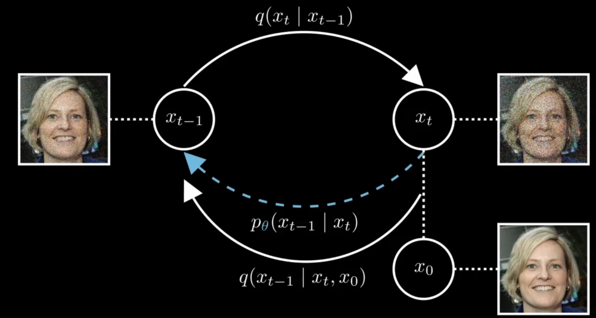

# 去噪扩散概率模型（Denoising Diffusion Probabilistic Models）

**作者**: Hongyi Zhao
**日期**: 2026年1月10日
**领域**: 生成式模型（图像生成）
**论文**: https://arxiv.org/pdf/2006.11239
**代码**: https://github.com/hojonathanho/diffusion

本文档旨在深度解读让扩散模型（Diffusion Models）走入大众视野的论文：去噪扩散概率模型（DDPM）。该篇论文引用量已突破32K，是了解图像生成技术原理，以及为后续此领域衍生模型打下基础的不二之选。

## 背景
在数据生成的背景下，我们将数据的概率分布P作为起点。以图像生成为例，这个分布P可以看作包含所有自然图像的集合，以可以是某一个只包含人脸图像的子集。然而，这样的分布极其复杂，以至于我们无法用一个明确的表达式来完整描述p(x)的概率。但即使我们没有这样的表达式，依然希望能够生成新的图像，也就是从这个理论上的分布P中取出新的样本。
因此，核心问题在于，在无法准确描述分布的情况下，如何找到生成新样本的方法，而扩散模型则是通过一个**加噪**和**去噪**的方式，巧妙地解决了这个难题。

## 技术详解

### 核心思路
首先对原图片逐步添加噪声，直至图片变成完全噪声图，接下来我们训练扩散模型的目的就是让它能逐步地反向还原这个被破坏的过程。如果模型足够有效，它就能从一团随机噪声开始，逐步恢复出有意义的图像。

### 加噪过程
首先，作者采用了添加高斯噪声的方式，让原始图像被一点点破坏，每一步操作都会往上一步的图像里加入少量噪声，让原本图像逐渐变得模糊不清。如果我们持续添加噪声，图片最后就只剩下一团噪点了。

**数学基础铺垫：**
- 加噪条件分布: $q(x_1 | x_0)$
- 具体做法为给 $x_0$ 加入一定量的高斯噪声 $\epsilon$ ，使得 $x_1 = x_0 + \beta*\epsilon$ ，且 $\epsilon～N(0,1)$
- 噪声强度由 $\beta$ 的数值来控制
- 通过这种表达方式，我们可以将加噪条件分布看作是以 $x_0$ 位中心，噪声方差为β的高斯分布，即 $q(x_1 | x_0) = N(x_0, \beta)$
- 接下来，第二步加噪过程可以看作为 $q(x_2 | x_1) = N(x_1, β)$
- 因为每一步都是叠加噪声，我们可以直接从 $x_0$ 推导到 $x_2$ ，即 $q(x_2 | x_0) = N(x_1, 2β)$
- 以此类推，对于任意时间 $t$，我们都可以直接写出该时间点的加噪结果 $x_t$，即 $q(x_t | x_0) = N(x_0, tβ)$

但是，这种加噪做法和理想中的扩散过程存在一定差异。我们理想中的加噪过程是希望能逐步把数据加噪成标准正态分布 $N(0,1)$ ，然而上面这种做法并没有达到这个目标，因为均值始终固定在最初的 $x_0$ 上，而方差会随着时间无限增加，即方差爆炸。

为了解决这个问题，作者构建了一个真正能收敛到标准正态分布的扩散过程。
具体做法为，通过在均值前引入一个系数，让它在不断的迭代中慢慢减小，最后接近于0，而这个系数就是用 $\sqrt{1 - \beta}$ 来表示的。因此我们可以得到：
$q(x_t|x_{t-1})=\sqrt{1 - \beta}*x_{t-1}+\beta*\epsilon$
为了能更简洁地表达从 $x_0$ 到 $x_t$ 的加噪过程，作者定义了另一个关键参数来表示 $(1-\beta)^t$：
$\bar\alpha_t = \prod_{i=1}^{t}(1-\beta_i)$
并将扩散过程的概率分布定义为:
$q(x_t|x_0) = \sqrt{\bar\alpha_t}x_0 + (1-\bar\alpha_t)\epsilon$
作者将 $\beta_i$ 的取值范围严格控制在[0, 1]之间，并且通过取不同 $\beta_i$ 值的方式来保证每一步加入不同强度的噪声。经过简单验证我们可以看到，此时的扩散过程随着 $t$ 的不断增加的确可以逐步收敛到一个标准的正态分布。直观来讲，整个扩散过程就是将一个任意的复杂原始数据分布变成标准正态分布的过程。这种方式最妙的地方在于，我们可以直接从最初分布跳到任意一步，而不必一层层迭代每个中间步骤。

### 去噪过程
在定义了正向加噪过程后，我们将讨论如何用神经网络把这个扩散过程逆转过来，从而实现真正意义上的图像生成。作者将逆向去噪条件分布定义为 $p_{\theta}(x_{t-1}|x_t)$，并通过训练这个神经网络来达到生成图像的目的。

#### 如何训练这个神经网络
作者采用了贝叶斯统计中的经典方法，通过最小化模型生成样本的负对数似然值 $-logp_{\theta}(x_0)$ 来训练

正向扩散过程：
- 从 $x_1$ 到 $x_t$ 所有变量在已知 $x_0$ 情况下的联合概率分布（正向扩散过程）: $q(x_1,...,x_T|x_0)$ 
- 贝叶斯定理拆解: $q(x_1,...,x_T|x_0)$ = $q(x_1|x_0)q(x_2|x_1,x_0)...q(x_T|x_{T-1},...,x_0)$
- 由于正向过程本身就是马尔可夫链，每一步只和前一步相关，因此我们可以写成: $q(x_1,...,x_T|x_0)$ = $q(x_1|x_0)q(x_2|x_1)...q(x_T|x_{T-1})$
- 简化表示: $q(x_{1:T}|x_0)$ = $\prod_{t=1}^{T}q(x_t|x_{t-1})$

逆向去噪过程：
- 简化表示: $p_{\theta}(x_{0:T})$ = $p_{\theta}(x_T)\prod_{t=1}^{T}p_{\theta}(x_{t-1}|x_t)$
- 由于逆向过程是从纯粹的高斯噪声开始生成图像，并不依赖任何先验信息，所以不依赖于任何特定的初始条件

    

负对数似然计算方式与损失函数公式推导：
- 处理联合概率分布时，常见的初步策略时通过边缘化将其他变量消除掉，这样 $p_{\theta}$ 就可以表示为联合概率分布对所有其他变量进行积分的结果，
即 $-logp_{\theta}(x_0)$ = $-log\int p_{\theta}(x_{0:T})dx_{1:T}$
- 但是我们没有办法直接计算这个积分，因为这个积分的意思是要计算神经网络生成 $x_0$ 样本的概率需要把所有可能的生成路径都积分求和，然而所有路径的数量太过庞大，根本无法一个个全部计算出来。所以为了能计算出负对数似然的值，我们需要做一些公式推导。
    - 同时乘以和除以前向过程的概率密度函数: $-logp_{\theta}(x_0)$ = $-log\int q(x_{1:T}|x_0)\frac{p_{\theta}(x_{0:T})}{q(x_{1:T}|x_0)}dx_{1:T}$
    - 将积分转化成期望值的形式: $-logp_{\theta}(x_0)$ = $\mathbb{E_{q(x_{1:T}|x_0)}}[\frac{p_{\theta}(x_{0:T})}{q(x_{1:T}|x_0)}]$
    - 詹森不等式: $-logp_{theta}(x_0)$ $\leq$ $-\mathbb{E_{q(x_{1:T}|x_0)}}[log\frac{p_{\theta}(x_{0:T})}{q(x_{1:T}|x_0)}]$
    - 现在我们得到了负对数似然的一个上界，即证据下界（Evidence Lower Bound，简称ELBO）: $-\mathbb{E_{q(x_{1:T}|x_0)}}[log\frac{p_{\theta}(x_{0:T})}{q(x_{1:T}|x_0)}]$
    - 通过一些代数变形和贝叶斯定理，我们可以继续简化这个表达式，由于推理过程比较复杂繁琐，这里就不多赘述了，感兴趣的可以去看原论文补充材料A部分，最终简化结果为: $-\mathbb{E}_{q} \left[ D_{\mathrm{KL}}(q(x_T \mid x_0) \parallel p(x_T)) + \sum_{t>1} D_{\mathrm{KL}}(q(x_{t-1} \mid x_t, x_0) \parallel p_\theta(x_{t-1} \mid x_t)) - \log p_\theta(x_0 \mid x_1) \right]$
    - 进一步简化可以发现，上面公式中的第一项和神经网络参数无关，所以可以忽略。而最后一项，由于一般去噪过程需要上千步，当从 $x_1$ 变到 $x_0$ 的时候，噪声已经基本被完全去掉，所以也可以忽略不计，所剩下的部分就是一系列KL散度的求和，即 $-\mathbb{E}_{q} \left[\sum_{t>1} D_{\mathrm{KL}}(q(x_{t-1} \mid x_t, x_0) \parallel p_\theta(x_{t-1} \mid x_t))\right]$
    - 在这个公式中 $p_\theta(x_{t-1} \mid x_t)$ 代表了逆向扩散步骤，而前半部分 $q(x_{t-1} \mid x_t, x_0)$ 则代表了真实后验分布
    - 一旦正向过程q被定义，就必然存在一个逆向过程，我们希望通过调整分布p的参数去逼近这个逆向过程，但我们已知原始图像 $x_0$ ，就可以精确地计算出这个逆向过程。这个利用原始清晰图像 $x_0$ 来定义的逆向过程就是我们说的**真实后验分布**
    - 因此这个损失函数的核心，就是**训练神经网络去拟合真实后验分布**，虽然网络实际能看到的只有 $x_t$ ，但通过这种方式，可以让它逐步逼近理论上只有已知 $x_0$ 时才能算出的真实答案
    - 同样通过一些代数变形和贝叶斯公式，我们可以得到这个真实后验分布的解析式，具体推导过程可参考原论文，最终结果是真实后验分布是一个高斯分布，表示方式为 $q(x_{t-1} \mid x_t, x_0) = \mathcal{N}(\tilde{\mu}_t, \tilde{\beta}_t)$
    - 接下来我们需要对近似后验分布 $p_\theta(x_{t-1} \mid x_t)$ 选择一个合适的形式，作者在这里同样选择了高斯分布，因为正向高斯马尔可夫链的逆过程依然是高斯分布，即 $p_\theta(x_{t-1} \mid x_t) = \mathcal{N}(\mu_{\theta}, \sigma_{\theta})$
    - 此时我们的神经网络要做的就是预测这个高斯分布的参数 $\mu_{\theta}$ 和 $\sigma_{\theta}$，为了进一步简化，作者选择将近似后验分布的方差设为一个常数。这就意味着神经网络只需要学习高斯分布的均值部分
    - KL散度的计算就是在计算两个均值的距离，即 $D_{\mathrm{KL}}(q(x_{t-1} \mid x_t, x_0) \parallel p_\theta(x_{t-1} \mid x_t)) = \frac{1}{2\sigma_t^2} \left\| \tilde{\mu}_t - \mu_\theta \right\|^2$ ，而我们的损失函数就是在尽量缩小这两个均值之间的差距
    - 此时我们的损失函数就变成了 $\mathbb{E}_{q} \left[ \sum_{t>1} \frac{1}{2\sigma_t^2} \left\| \tilde{\mu}_t - \mu_\theta(x_t, t) \right\|^2 \right]$
    - 虽然此时我们可以写出 $\tilde{\mu}_t$ 的表达式，即 $\tilde{\mu}_t = \frac{\sqrt{\bar{\alpha}_{t-1}}}{1 - \bar{\alpha}_t} x_0 + \frac{\sqrt{\bar{\alpha}_t} (1 - \bar{\alpha}_{t-1})}{1 - \bar{\alpha}_t} x_t$ ，可以理解为 $x_0$ 和 $x_t$ 的加权平均，但这个公式还是有点复杂
    - 得益于前面加噪过程中的参数定义，我们可以把 $x_t$ 写成 $x_t = \sqrt{\bar\alpha_t}x_0 + \sqrt{1-\bar\alpha_t}\epsilon$ ，并得到 $x_0$ 的表达式，即 $x_0 = \frac{1}{\sqrt{\alpha_t}}(x_t - \sqrt{1 - \alpha_t}\epsilon)$
    - 将上面的结果带入到 $\tilde{\mu}_t$ 的表达式中，就得到了 $\tilde{\mu}_t = \frac{1}{\sqrt{\alpha_t}}(x_t - \frac{\beta_t}{\sqrt{1 - \alpha_t}}\epsilon)$ 
    - 因为去噪网络也可以获得 $x_t$ 的信息，我们也可以用同样的重参数化技巧把网络预测的均值写成这种形式，即 $\mu_{\theta}(x_t, t) = \frac{1}{\sqrt{\alpha_t}}(x_t - \frac{\beta_t}{\sqrt{1 - \alpha_t}}\epsilon_{\theta}(x_t, t))$ 
    - 此时将 $\tilde{\mu}_t$ 和 $\mu_\theta(x_t, t)$ 带入损失函数，$x_t$ 这部分会互相抵消，就得到了 $\mathcal{L} = \mathbb{E}_{q} \left[ \sum_{t>1} \frac{\beta_t^2}{2\sigma_t^2 \alpha_t (1 - \bar{\alpha}_t)} \left\| \epsilon - \epsilon_\theta(x_t, t) \right\|^2 \right]$ ，这个损失函数就是真实损失 $\epsilon$ 和预测损失 $\epsilon_{\theta}(x_t, t)$ 之间的平方距离，最小化损失函数就是要让网络的预测尽可能准确地还原噪声
    - 根据这个公式，如果我们对每个样本都计算上千次时间步的损失，计算量会非常大。所以实际训练时，我们通常随机选择一个时间步t，对每个样本只计算一次损失，根据大数定律，如果样本量足够大，这种做法可以很好地逼近原始的目标函数
    - 至此，所有简化过程全部完成，我们也得到了**最终的损失函数**，即 **$\mathbb{E}_{q,t} \left[ \frac{\beta_t^2}{2\sigma_t^2 \alpha_t (1 - \bar{\alpha}_t)} \left\| \epsilon - \epsilon_\theta(x_t, t) \right\|^2 \right]$**

## 总结
本文档详细介绍了什么是扩散模型（Diffusion Model），并一步步梳理了从加噪过程、神经网络去噪预测到损失函数的推理过程。看到这里你对扩散模型的原理以及是如何训练的已经有了一个基本的概念，但值得注意的是，由于DDPM在训练时并没有加入任何条件输入，所以DDPM是一个无条件生成模型，意味着你无法指定内容来控制它的生成结果。虽然如此，DDPM本身展示了强大的图像生成能力，并为后续扩散模型的研究奠定了基础。

