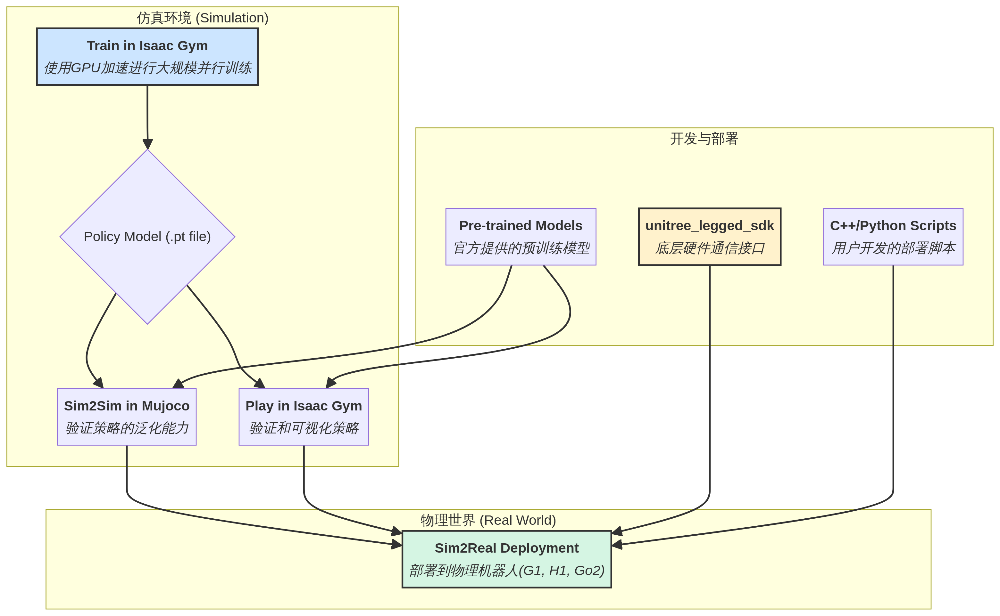

# 宇树科技开源技术栈深度调研

**作者**: Damon Li  
**日期**: 2025年12月03日  
**来源**: https://github.com/unitreerobotics, https://support.unitree.com/

## 1. 公司背景

### 1.1 公司概况

宇树科技（Unitree Robotics）是中国领先的四足机器人和人形机器人研发公司，以其高性能、低成本的机器人产品在全球市场占据重要地位。

### 1.2 产品线

宇树科技的产品矩阵包括：

1. **四足机器人系列**：
   - Go2：消费级四足机器人
   - B2：工业级四足机器人
   - Aliengo、A1等早期型号

2. **人形机器人系列**：
   - **H1**：通用人形机器人
   - **H1_2**：H1的升级版本
   - **G1**：最新一代人形机器人

## 2. Unitree RL GYM 强化学习框架

### 2.1 项目概述

**GitHub仓库**: https://github.com/unitreerobotics/unitree_rl_gym  
**Stars**: 2.6k+  
**Forks**: 423  
**开源协议**: BSD-3-Clause

**核心特点**：

- 基于强化学习实现机器人运动控制
- 支持多款宇树机器人：Go2, H1, H1_2, G1
- 提供完整的训练到部署流程
- 支持多种仿真环境（Isaac Gym, Mujoco）
- 支持物理机器人部署（Sim2Real）

### 2.2 技术架构

#### 2.2.1 工作流程


*图：宇树科技RL Gym工作流程图*

宇树RL GYM采用标准的强化学习工作流程：

```
Train → Play → Sim2Sim → Sim2Real
```

1. **Train（训练）**：
   - 在Gym仿真环境中训练策略
   - 机器人与环境交互，最大化设计的奖励
   - 不推荐实时可视化以提高效率

2. **Play（验证）**：
   - 可视化验证训练结果
   - 确保策略符合预期
   - 导出Actor网络

3. **Sim2Sim（仿真迁移）**：
   - 将Gym训练的策略部署到其他仿真器（如Mujoco）
   - 确保策略不过度依赖Gym特性

4. **Sim2Real（实物部署）**：
   - 将策略部署到物理机器人
   - 实现真实环境的运动控制

#### 2.2.2 目录结构

```
unitree_rl_gym/
├── legged_gym/          # 训练和运行代码
│   └── scripts/
│       ├── train.py     # 训练脚本
│       └── play.py      # 验证脚本
├── deploy/              # 部署代码
│   ├── deploy_mujoco/   # Mujoco仿真部署
│   ├── deploy_real/     # 物理机器人部署
│   │   ├── configs/     # 配置文件
│   │   └── cpp_g1/      # G1的C++部署示例
│   └── pre_train/       # 预训练模型
├── resources/robots/    # 机器人资源文件
└── doc/                 # 文档
```

### 2.3 核心功能

#### 2.3.1 训练（Train）

**命令**：
```bash
python legged_gym/scripts/train.py --task=xxx
```

**参数说明**：

| 参数 | 说明 | 默认值 |
|------|------|--------|
| `--task` | 机器人任务（go2, g1, h1, h1_2） | 必填 |
| `--headless` | 无头模式（提高效率） | False |
| `--resume` | 从检查点恢复训练 | - |
| `--experiment_name` | 实验名称 | - |
| `--run_name` | 运行名称 | - |
| `--load_run` | 加载的运行名称 | 最新 |
| `--checkpoint` | 检查点编号 | 最新 |
| `--num_envs` | 并行环境数量 | - |
| `--seed` | 随机种子 | - |
| `--max_iterations` | 最大训练迭代次数 | - |
| `--sim_device` | 仿真计算设备 | GPU |
| `--rl_device` | 强化学习计算设备 | GPU |

**训练结果保存路径**：
```
logs/<experiment_name>/<date_time>_<run_name>/model_<iteration>.pt
```

#### 2.3.2 验证（Play）

**命令**：
```bash
python legged_gym/scripts/play.py --task=xxx
```

**功能**：

- 在Gym中可视化训练结果
- 默认加载最新模型
- 导出Actor网络到 `logs/{experiment_name}/exported/policies/`
  - 标准网络（MLP）：`policy_1.pt`
  - RNN网络：`policy_lstm_1.pt`

#### 2.3.3 Sim2Sim（Mujoco仿真）

**命令**：
```bash
python deploy/deploy_mujoco/deploy_mujoco.py {config_name}
```

**示例**：
```bash
python deploy/deploy_mujoco/deploy_mujoco.py g1.yaml
```

**配置文件路径**：`deploy/deploy_mujoco/configs/`

**模型替换**：

- 默认模型：`deploy/pre_train/{robot}/motion.pt`
- 自定义模型：`logs/g1/exported/policies/policy_lstm_1.pt`
- 在YAML配置文件中更新 `policy_path`

#### 2.3.4 Sim2Real（物理部署）

**Python部署**：
```bash
python deploy/deploy_real/deploy_real.py {net_interface} {config_name}
```

**参数说明**：

- `net_interface`：连接机器人的网卡名称，如 `enp3s0`
- `config_name`：配置文件，如 `g1.yaml`, `h1.yaml`, `h1_2.yaml`

**C++部署示例（G1）**：

宇树提供了G1的C++部署示例，位于 `deploy/deploy_real/cpp_g1/`

**依赖安装**：
```bash
wget https://download.pytorch.org/libtorch/cpu/libtorch-cxx11-abi-shared-with-deps-2.7.1%2Bcpu.zip
unzip libtorch-cxx11-abi-shared-with-deps-2.7.1+cpu.zip
```

**编译**：
```bash
mkdir build
cd build
cmake ..
make -j4
```

**运行**：
```bash
./g1_deploy_run {net_interface}
```

### 2.4 技术依赖

宇树RL GYM基于以下开源项目构建：

1. **legged_gym**：训练和运行代码的基础框架
2. **rsl_rl**：强化学习算法实现
3. **mujoco**：提供强大的仿真功能
4. **unitree_sdk2_python**：物理部署的硬件通信接口

### 2.5 支持的机器人型号

| 机器人 | 类型 | 支持状态 |
|--------|------|---------|
| Go2 | 四足机器人 | ✅ 完全支持 |
| G1 | 人形机器人 | ✅ 完全支持 |
| H1 | 人形机器人 | ✅ 完全支持 |
| H1_2 | 人形机器人（升级版） | ✅ 完全支持 |

## 3. 文档中心调研

### 3.1 RL GYM文档

**文档地址**: https://support.unitree.com/home/zh/rl_gym/intro

待深入调研内容：
- [ ] 详细的安装配置指南
- [ ] 训练参数调优建议
- [ ] 奖励函数设计
- [ ] 常见问题解答

### 3.2 主文档中心

**文档地址**: https://support.unitree.com/main/zh

待深入调研内容：
- [ ] 产品文档
- [ ] SDK文档
- [ ] 开发者指南
- [ ] API参考

---

## 待深入调研内容

- [ ] 文档中心详细内容
- [ ] SDK技术架构
- [ ] 与其他开源机器人框架的对比
- [ ] 社区生态和开发者支持
- [ ] 商业化应用案例


## 4. 产品技术参数详解

### 4.1 Unitree G1 人形机器人

**官方网站**: https://www.unitree.com/g1  
**定位**: 人形智能体AI化身（Humanoid agent AI avatar）  
**起售价**: $13,500（基础版）

#### 4.1.1 机械参数

| 参数类别 | G1 基础版 | G1 EDU版 |
|---------|----------|----------|
| **站立尺寸** | 1320×450×200mm | 1320×450×200mm |
| **折叠尺寸** | 690×450×300mm | 690×450×300mm |
| **重量（含电池）** | 约35kg | 约35kg+ |
| **总自由度** | 23 | 23-43 |
| **单腿自由度** | 6 | 6 |
| **腰部自由度** | 1 | 1（可选+2） |
| **单臂自由度** | 5 | 5 |
| **单手自由度** | / | 7（可选三指灵巧手）+2（可选腕部） |
| **小腿+大腿长度** | 0.6M | 0.6M |
| **臂展** | 约0.45M | 约0.45M |

#### 4.1.2 关节性能

**核心特性**：

- **工业级交叉滚子轴承**：高精度、高负载能力
- **低惯量高速内转子永磁同步电机（PMSM）**：更快响应速度和散热性能
- **双编码器**：提供精确位置反馈
- **全关节中空电气走线**：优化内部布线

**关节扭矩**：

- 膝关节最大扭矩：90N.m（基础版）/ 120N.m（EDU版）
- 手臂最大负载：约2Kg（基础版）/ 约3Kg（EDU版）

**超大关节运动空间**：

| 关节 | 运动范围 |
|------|---------|
| 腰部关节 | Z轴：±155°（EDU版额外：X轴±45°、Y轴±30°） |
| 膝关节 | 0~165° |
| 髋关节 | P轴：±154°、R轴：-30~+170°、Y轴：±158° |
| 腕关节（EDU版） | P轴：±92.5°、Y轴：±92.5° |

#### 4.1.3 电气特性

| 参数 | 规格 |
|------|------|
| **供电** | 13串锂电池 |
| **基础算力** | 8核高性能CPU |
| **高算力模块（EDU版）** | NVIDIA Jetson Orin |
| **感知传感器** | 深度相机 + 3D激光雷达 |
| **音频** | 4麦克风阵列 + 5W扬声器 |
| **无线通信** | WiFi 6、蓝牙5.2 |
| **冷却系统** | 局部风冷 |

#### 4.1.4 配件与续航

- **智能电池**：9000mAh，快拆设计
- **充电器**：54V 5A
- **续航时间**：约2小时
- **手动控制器**：标配
- **OTA升级**：支持持续软件升级

#### 4.1.5 核心技术特点

1. **超越常人的灵活性**：23-43个关节电机，超大关节运动角度空间
2. **模仿与强化学习驱动**：AI加速的机器人技术每天升级演进
3. **力控灵巧手**：结合力位混合控制，灵敏可靠，模拟人手实现精确操作
4. **机器人世界模型**：UnifoLM（统一机器人大模型）

### 4.2 Unitree H1 / H1-2 人形机器人

**官方网站**: https://www.unitree.com/h1  
**定位**: 全尺寸通用人形机器人

#### 4.2.1 H1-2 技术参数

| 参数 | 数值 |
|------|------|
| **身高** | 约178cm |
| **重量** | 约70kg |
| **感知** | 360°深度感知（3D激光雷达 + 深度相机） |
| **核心电机** | M107自研电机 |
| **最大扭矩** | 360N.m |
| **最大拉力** | 10000N（在3.5cm力臂等效条件下） |
| **电机设计** | 中空走线 |

#### 4.2.2 技术特点

1. **全尺寸设计**：接近人类身高和体重
2. **超高扭矩**：M107电机提供360N.m扭矩，远超G1
3. **360°感知**：3D激光雷达 + 深度相机实现全方位环境感知
4. **适用场景**：工业制造、物流搬运、特种作业

### 4.3 Unitree Go2 四足机器人

**定位**: 消费级四足机器人  
**特点**:

- 支持强化学习训练
- 完整的SDK支持
- 适合教育和研究场景
- 成熟的商业化产品

## 5. SDK与开发生态

### 5.1 SDK体系

宇树科技提供了完整的SDK体系，覆盖不同产品线：

#### 5.1.1 主要SDK

| SDK名称 | 支持机器人 | 功能 |
|---------|-----------|------|
| **unitree_legged_sdk** | Aliengo, A1, Go1, B1 | 四足机器人真实环境开发SDK |
| **unitree_sdk2** | H1, G1, Go2, B2 | 新一代统一SDK |
| **unitree_sdk2_python** | H1, G1, Go2, B2 | Python版本SDK，用于物理部署 |
| **unitree_mujoco** | 多款机器人 | Mujoco仿真器接口，支持C++/Python |

#### 5.1.2 开源仓库统计

根据GitHub数据，宇树科技的主要开源仓库包括：

1. **unitree_rl_gym**: 2.6k+ Stars, 423 Forks
2. **unitree_legged_sdk**: 用于四足机器人开发
3. **unitree_sdk2**: 新一代统一SDK
4. **unitree_mujoco**: Mujoco仿真集成

### 5.2 开发工具链

#### 5.2.1 仿真环境

- **Isaac Gym**: 高性能GPU加速仿真
- **Mujoco**: 物理精确仿真
- **Unitree Sim**: 官方仿真平台

#### 5.2.2 通信协议

- 基于DDS（Data Distribution Service）的实时通信
- 支持ROS2集成
- 提供C++和Python接口

### 5.3 文档中心

**官方文档**: https://support.unitree.com/

**文档结构**：

1. **通用人形机器人**
   - H1 SDK 开发指南
   - G1 SDK 开发指南
   - 开源适配
   - 遥操作
   - 强化学习运动控制

2. **四足机器人**
   - Go2 SDK 开发指南
   - B2 SDK 开发指南
   - Go2-W SDK 开发指南
   - 四足机器人算法实践

3. **机械臂**
   - Z1 SDK 开发指南

4. **组件**
   - 电机 SDK 开发指南
   - SV1-25 开发指南
   - Dex3-1 SDK开发指南

5. **感知**
   - L1 SDK 开发指南（4D激光雷达）
   - L2 SDK 开发指南

### 5.4 AI文档助理

宇树文档中心集成了AI文档助理，支持：

- 智能问答
- 文档检索
- 代码示例查询
- 常见问题解答

## 6. 技术创新与行业地位

### 6.1 核心技术优势

#### 6.1.1 自研电机技术

宇树科技在电机技术上具有深厚积累：

1. **低惯量高速内转子PMSM**：
   - 更快的响应速度
   - 更好的散热性能
   - 更高的功率密度

2. **中空走线设计**：
   - 优化内部布线
   - 提升整洁度和可靠性
   - 减少故障点

3. **双编码器系统**：
   - 提供精确位置反馈
   - 支持力位混合控制

#### 6.1.2 强化学习框架

宇树的强化学习框架具有以下特点：

1. **完整的工作流程**：Train → Play → Sim2Sim → Sim2Real
2. **多仿真器支持**：Isaac Gym、Mujoco
3. **高效训练**：支持GPU加速、并行环境
4. **易于部署**：提供Python和C++部署方案

#### 6.1.3 力位混合控制

结合力控制和位置控制，实现：

- 灵敏的环境交互
- 精确的物体操作
- 安全的人机协作

### 6.2 商业化成就

#### 6.2.1 价格优势

- **G1基础版**：$13,500，是业内最具性价比的人形机器人之一
- **H1/H1-2**：面向工业应用，价格竞争力强
- **Go2**：消费级四足机器人，已实现规模化销售

#### 6.2.2 市场表现

- 产品销往全球多个国家和地区
- 在教育、科研、工业等领域广泛应用
- 开源社区活跃，开发者众多

### 6.3 与竞品对比

| 公司 | 代表产品 | 价格 | 开源程度 | 强化学习 | 商业化 |
|------|---------|------|---------|---------|--------|
| **宇树科技** | G1, H1 | $13.5K+ | ⭐⭐⭐⭐ | ✅ 完整 | ✅ 规模化 |
| 智元机器人 | 灵犀X1 | ~10万元 | ⭐⭐⭐⭐⭐ | ✅ 完整 | ⚠️ 小批量 |
| Boston Dynamics | Atlas | 不对外销售 | ⭐ | ❌ | ❌ |
| Tesla | Optimus | 未定价 | ⭐ | ⚠️ 部分 | ❌ |
| Figure AI | Figure 01 | 未定价 | ⭐ | ⚠️ 部分 | ⚠️ 试点 |

**宇树科技的优势**：

1. **价格优势**：G1起售价$13.5K，是业内最具性价比的产品
2. **开源生态**：提供完整的SDK和强化学习框架
3. **商业化成熟度**：已实现规模化生产和销售
4. **技术完整性**：从硬件到软件、从仿真到部署的全栈方案

## 7. 应用场景与案例

### 7.1 教育与科研

- 高校机器人实验室
- 强化学习研究
- 人形机器人算法开发
- 学生竞赛和项目

### 7.2 工业应用

- 柔性生产线
- 质检和搬运
- 危险环境作业
- 巡检和维护

### 7.3 商业服务

- 餐饮服务
- 零售导购
- 酒店服务
- 展览展示

### 7.4 家庭服务

- 家政服务
- 陪伴机器人
- 教育辅导
- 健康监测

## 8. 未来发展方向

### 8.1 技术路线图

1. **AI能力提升**：
   - 集成更强大的大模型
   - 提升多模态感知能力
   - 增强任务规划和决策能力

2. **硬件性能优化**：
   - 提升电机扭矩和功率密度
   - 增加传感器种类和精度
   - 优化能源管理和续航

3. **软件生态完善**：
   - 持续更新SDK和工具链
   - 丰富应用场景和案例
   - 加强社区建设和开发者支持

### 8.2 市场策略

1. **价格下探**：通过规模化生产降低成本
2. **场景拓展**：从教育科研向工业和服务场景延伸
3. **生态建设**：吸引更多开发者和合作伙伴

### 8.3 行业影响

宇树科技通过以下方式推动人形机器人产业发展：

1. **降低门槛**：提供高性价比产品和完整开发工具
2. **开源共享**：开放核心技术和算法框架
3. **商业化验证**：证明人形机器人的商业可行性

---

## 参考资料

1. Unitree Robotics官网：https://www.unitree.com/
2. GitHub - unitree_rl_gym：https://github.com/unitreerobotics/unitree_rl_gym
3. 宇树科技文档中心：https://support.unitree.com/
4. G1产品页面：https://www.unitree.com/g1
5. H1产品页面：https://www.unitree.com/h1
6. RL GYM文档：https://support.unitree.com/home/zh/rl_gym/intro
